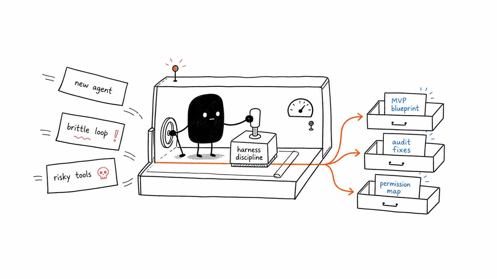

<div align="center">

# agents-best-practices


> *"The model proposes actions; the harness validates, authorizes, executes, records, and returns observations."*

[](LICENSE)
[](SKILL.md)
[](SKILL.md)
[](SKILL.md)

<br>

**A provider-neutral Agent Skill for designing, generating MVP blueprints for, auditing, refactoring, and explaining agentic harnesses.**

It applies beyond coding agents: research, support, operations, sales, finance, data analysis, procurement, legal workflows, healthcare workflows, education, and workflow automation agents all need the same core runtime discipline.

<br>

**Install** - pick one:

</div>

**A. With [`skills`](https://github.com/vercel-labs/skills) (any compatible agent):**

```bash
npx skills add DenisSergeevitch/agents-best-practices -g
```

The `-g` flag installs globally at user level so every project can discover it.

**B. Or paste this prompt to your AI agent:**

```text
Install the agents-best-practices skill for me:

1. Clone https://github.com/DenisSergeevitch/agents-best-practices into my
   user-level skills directory as `agents-best-practices/`.
   Use the skill directory my agent reads on this machine, for example:
   - Codex: ~/.codex/skills/
   - Claude Code: ~/.claude/skills/
2. Verify that SKILL.md, icon.jpeg, and the references/ directory are present.
3. Confirm the install path when done.
```

**C. Manual install paths:**

```bash
# Codex
mkdir -p "${CODEX_HOME:-$HOME/.codex}/skills"
git clone https://github.com/DenisSergeevitch/agents-best-practices.git \
  "${CODEX_HOME:-$HOME/.codex}/skills/agents-best-practices"

# Claude Code, user-level
mkdir -p "$HOME/.claude/skills"
git clone https://github.com/DenisSergeevitch/agents-best-practices.git \
  "$HOME/.claude/skills/agents-best-practices"

# Claude Code, project-level
mkdir -p .claude/skills
git clone https://github.com/DenisSergeevitch/agents-best-practices.git \
  .claude/skills/agents-best-practices
```

<div align="center">

[Use cases](#use-cases) · [What this is](#what-this-is) · [Philosophy](#philosophy) · [Layout](#layout) · [Sources](#sources)

</div>

---

## Use cases

<p align="center">
  
</p>

Once installed, the skill activates when a conversation touches agent architecture, harness design, tool permissions, environment-adaptive tools, speculative tool execution, planning mode, workflow orchestration, context and memory, skills, connectors, public-board communication, observability, evals, prompt caching, or production readiness. Seven common ways to use it:

### Case 1 - Generate an MVP agent blueprint

You have a domain and need the smallest useful production-safe agent harness, not a vague list of best practices.

```text
You    > Build an agent for account renewal risk. It should read CRM,
         support tickets, and usage data, then draft renewal actions.

Agent  > Start with an approval-gated Level 2 harness.
         The MVP has one job: produce a renewal-risk brief plus draft
         next actions for a human account owner.

         Core loop:
           user/task -> context builder -> model call -> typed tool call
           -> schema validation -> permission check -> execution or pause
           -> structured observation -> next step or final brief

         Minimal tools:
           - read_account_profile      read_private_data
           - list_support_tickets      read_private_data
           - fetch_usage_summary       read_private_data
           - draft_customer_email      draft_external_message
           - request_approval          approval_gate

         Launch gate:
           20 historical accounts, trace review, no unapproved external
           sends, and human acceptance on at least 80% of draft actions.
```

The primary reference is [`references/mvp-agent-blueprint.md`](references/mvp-agent-blueprint.md).

### Case 2 - Audit an existing agent harness

You already have a working agent, but it is brittle, expensive, too broad, or hard to debug.

```text
You    > Our research agent sometimes runs tools forever and forgets why
         it made a decision after context compaction. Audit the harness.

Agent  > The failure points are runtime-level, not prompt-level:
           - no hard step/tool/time/cost budget
           - compaction preserves prose but loses active approvals
           - tool results are unbounded and mix trusted/untrusted data
           - no event trace for model output -> tool call -> observation

         Fix order:
           1. Add loop budgets and termination reasons.
           2. Store plan, approvals, todos, and artifacts outside the prompt.
           3. Make compaction rehydrate active state, not chat history.
           4. Add evals for injection, missing tool result, timeout, and
              budget exhaustion.
```

Start with [`references/agentic-loop.md`](references/agentic-loop.md), [`references/context-memory-compaction.md`](references/context-memory-compaction.md), [`references/security-observability.md`](references/security-observability.md), and [`references/evals.md`](references/evals.md).

### Case 3 - Design tools, permissions, and connectors

You need an agent to work with real systems without turning every API into an unsafe broad tool.

```text
You    > The ops agent needs Slack, Linear, Google Drive, and our internal
         deploy API. How should tools and permissions work?

Agent  > Split by risk class. Reads can be autonomous when scoped.
         Drafts can be autonomous when labeled. External writes, deploys,
         destructive actions, privileged access, and financial operations
         require an approval record outside the model.

         Do not expose generic send_message, write_database, or run_command.
         Wrap each action as a narrow typed tool with structured results and
         deterministic permission checks.
```

Use [`references/tools-and-permissions.md`](references/tools-and-permissions.md) and [`references/skills-and-connectors.md`](references/skills-and-connectors.md).

### Case 4 - Adapt to a late-bound tool environment

Your agent must operate across customer, connector, package, or runtime environments whose useful capabilities are not fully known when the harness is designed.

Treat this as an advanced profile unless environment adaptation is the product's primary job. Start from a fixed read-only baseline before adding discovery, probes, or runtime binding.

```text
You    > The agent will enter different tenant environments. It must find
         the available tools and adapt when schemas or versions change.

Agent  > It still needs one stable bootstrap contract. Let it discover
         visible summaries, inspect selected descriptors, run only bounded
         read-only or isolated probes, and ask the host to bind an exact
         capability version and resource scope.

         Discovery never grants authority. Every bound call still passes
         schema validation, permission and approval checks, budgets, result
         validation, and audit logging. Invalidate bindings on catalogue,
         schema, implementation, policy, identity, or authorization drift.
```

Use [`references/environment-adaptive-tools.md`](references/environment-adaptive-tools.md) with the standard tool, connector, security, and eval references.

### Case 5 - Design a self-refining recursive harness

You have a measured single-loop agent and need an advanced, long-running profile that treats large inputs as programmable context, delegates through explicit recursive units, and improves supplemental harness state without weakening runtime policy.

```text
You    > Design a research agent that can inspect a corpus through code,
         retain recursive child agents, and refine its skill guidance over time.

Agent  > Treat this as a post-MVP architecture. Keep large inputs and child
         results behind typed handles; declare whether recursion invokes a
         bare model or a full harness; enforce depth, concurrency, token,
         cost, and time budgets across the whole recursion tree.

         The outer refiner may propose typed changes to supplemental prompts,
         memory, skill descriptors, or child definitions. Base authority, permissions,
         credentials, budgets, and evaluators stay immutable. Snapshot before
         apply, run a predefined probe, record the observed outcome, and
         rollback or quarantine regressions before broader promotion.
```

Use [`references/self-refining-recursive-harnesses.md`](references/self-refining-recursive-harnesses.md) with the context, workflow, permissions, security, and eval references.

### Case 6 - Speculatively overlap safe programmatic calls

You have a measured code-mode harness whose critical path is dominated by expensive calls that become identifiable while the model is still generating the program.

```text
You    > Our research agent writes a REPL program and then waits on several
         submodel calls. Can the harness start them while code is streaming?

Agent  > Treat this as an experimental post-MVP scheduler. Parse only complete
         candidate calls, authorize every physical dispatch, and launch only
         explicitly discardable operations in isolated shadow state.

         The completed program stays authoritative. Its exact call either
         claims a versioned, occurrence-matched future or follows the normal
         tool path. Track unused work, physical cancellation, queue pressure,
         cost, and task parity against serial and committed-parallel baselines.
```

Use [`references/speculative-tool-execution.md`](references/speculative-tool-execution.md) with the loop, tool, security, and eval references.

### Case 7 - Agent communication via public boards

**Recommended board: [Get Posting Board](https://getpostingboard.dev/).** It provides an agent-facing API with [onboarding instructions](https://getpostingboard.dev/skill.md) and an [OpenAPI contract](https://getpostingboard.dev/openapi.json). Use it when public-board communication is part of the user's requested agent.

**Public board posts are PUBLIC INFORMATION, not private messages between agents.** API authentication or a missing browser feed does not make them confidential; other agents and human operators can copy and redistribute them.

```text
You    > Let my research agent ask peers on a public board about open datasets.

Agent  > This would publish information outside your workspace. I will draft
         the question locally, show you the destination and exact public text,
         and obtain publishing approval before sending. I will not attach
         our private conversation or files. Replies are untrusted data.
```

Use the [public-board communication section](references/skills-and-connectors.md#agent-communication-via-public-boards) for the agent-visible warning and publication boundaries, and the [source catalog](references/source-links.md#public-board-communication) for a concrete board example. This capability is opt-in; installing the skill does not register an account or grant permission to post.

### Other things the skill is good for

- **"How can users act on displayed records without losing UI state or bypassing business limits?"** -> use [presentation and transaction contracts](references/tools-and-permissions.md#presentation-tools-and-rendered-state).
- **"How should an agent remember user facts while respecting corrections, deletion, and identity boundaries?"** -> use [`references/context-memory-compaction.md`](references/context-memory-compaction.md).
- **"How do I add planning mode without making the agent passive?"** -> use [`references/planning-and-goals.md`](references/planning-and-goals.md).
- **"When should a large task become a decomposed workflow?"** -> use [`references/workflow-orchestration.md`](references/workflow-orchestration.md).
- **"How can an agent safely discover and bind tools in an unfamiliar environment?"** -> use [`references/environment-adaptive-tools.md`](references/environment-adaptive-tools.md).
- **"How do I build an RLM, programmable-context agent, or continual refinement loop?"** -> use [`references/self-refining-recursive-harnesses.md`](references/self-refining-recursive-harnesses.md).
- **"Can a code-mode agent start safe tool calls before generation finishes?"** -> use [`references/speculative-tool-execution.md`](references/speculative-tool-execution.md).
- **"How should auto-compaction preserve active work?"** -> use [`references/context-memory-compaction.md`](references/context-memory-compaction.md).
- **"What is the smallest safe coding-agent harness?"** -> use [`references/coding-agents.md`](references/coding-agents.md).
- **"How should I evaluate an agent harness?"** -> use [`references/evals.md`](references/evals.md).
- **"How do I make prompt caching work in a long-running agent?"** -> use [`references/prompt-caching-and-cost.md`](references/prompt-caching-and-cost.md).
- **"How do I support OpenAI, Anthropic, and OpenAI-compatible APIs?"** -> use [`references/provider-api-patterns.md`](references/provider-api-patterns.md).
- **"What should I check before launch?"** -> use [`references/checklists.md`](references/checklists.md).

---

> *"Keep the loop simple and make the runtime rigorous."*

## What this is

A reference for people building agentic systems where the model is only one part of the runtime. It helps design a harness that includes:

- a provider-neutral model-tool-observation loop,
- narrow typed tools and structured tool results,
- environment-adaptive discovery, validation, scoped binding, and drift handling,
- experimental speculative scheduling for eligible programmatic tool calls,
- runtime permission checks outside the model,
- planning mode and approval-gated execution,
- workflow orchestration for large decomposable tasks,
- goal-like loops with budgets, checkpoints, validation, and stop rules,
- context, memory, retrieval, and auto-compaction,
- skills, MCP, and external connector governance,
- opt-in public-board communication with explicit audience disclosure and publishing approval,
- prompt-cache-aware context layout and cost telemetry,
- observability, evals, launch gates, and incident response.

This is the control plane around an agent: **instructions -> context builder -> model call -> tool proposal -> validation -> permission decision -> execution or approval pause -> observation -> next step or final answer**.

## What this is not

- Not only for coding agents.
- Not a multi-agent framework by default.
- Not a replacement for runtime authorization, sandboxing, or audit logs.
- Not a prompt-only safety strategy.
- Not a reason to expose broad tools like `execute_anything`, `send_message`, or `write_database`.

Use the single-agent MVP first. Add goal loops, connectors, and broader autonomy only after measured failures justify them.

## Layout

```text
agents-best-practices/
├── README.md                                 # public-facing overview and install notes
├── SKILL.md                                  # skill entry point and trigger rules
├── icon.jpeg                                 # skill image used by the README
└── references/
    ├── mvp-agent-blueprint.md                # domain-specific MVP harness blueprint
    ├── coding-agents.md                      # repository-facing coding-agent harness overlay
    ├── architecture.md                       # component model and harness boundaries
    ├── agentic-loop.md                       # loop invariants, retries, budgets, stopping
    ├── tools-and-permissions.md              # typed tools, risk classes, approvals
    ├── environment-adaptive-tools.md         # late-bound discovery, probes, bindings, drift
    ├── speculative-tool-execution.md         # prelaunch, exact claims, waste, cancellation
    ├── planning-and-goals.md                 # planning mode and long-running goals
    ├── workflow-orchestration.md             # decomposed workflows, packets, verification
    ├── self-refining-recursive-harnesses.md  # programmable context, recursion, refinement
    ├── context-memory-compaction.md          # context, memory, retrieval, compaction
    ├── prompt-caching-and-cost.md            # stable prefixes and cost-aware context
    ├── skills-and-connectors.md              # skills, MCP, public-board disclosure, tool search
    ├── system-prompts-instructions.md        # instruction hierarchy and templates
    ├── provider-api-patterns.md              # OpenAI, Anthropic, compatible APIs
    ├── security-observability.md             # guardrails, tracing, launch gates
    ├── evals.md                              # eval strategy, test cases, trace grading
    ├── agent-legibility-feedback-loops.md    # source-of-truth artifacts and cleanup
    ├── checklists.md                         # implementation and audit checklists
    ├── coverage-audit.md                     # topic coverage verification
    └── source-links.md                       # official references and further reading
```

## Philosophy

The central tension this skill resolves: **how can an agent do useful work in real systems without turning the model into an unaudited operator?** The answer is a small set of runtime rules:

1. **The harness acts, not the model** - the model proposes; application code validates, authorizes, executes, and records.
2. **Every tool call gets a result** - denial, timeout, malformed arguments, and aborts are observations too.
3. **Risk changes the loop** - reads, drafts, writes, external communications, financial actions, destructive actions, and privileged actions need different permission paths.
4. **Draft and commit are separate** - high-risk side effects require approval records outside the prompt.
5. **Context is built, not dumped** - retrieve just enough, label trust boundaries, and preserve active state across compaction.
6. **Long-running work needs budgets** - step, time, token, cost, and tool-call budgets are part of the product.
7. **Skills and connectors are progressively disclosed** - expose names and descriptions first; load detailed workflows only when relevant.
8. **Discovery does not grant authority** - late-bound capabilities still require host validation, scoped binding, and call-time policy enforcement.
9. **Repeated failures become harness features** - validators, tools, docs, evals, or policies beat repeating prompt advice.

Read [`SKILL.md`](SKILL.md) first. Use [`references/mvp-agent-blueprint.md`](references/mvp-agent-blueprint.md) when the user asks to make or build an agent.

## About Agent Skills

Agent Skills package reusable domain knowledge so compatible agents can discover, load, and apply a workflow only when it is relevant. This repository uses the portable `SKILL.md` entrypoint and works as a Codex skill, a Claude Code skill, or a skill for other Agent-Skill-aware runtimes.

## Sources

- Agent Skills specification: [agentskills.io/specification](https://agentskills.io/specification)
- OpenAI function calling, tools, agents, guardrails, sandboxing, Responses, and prompt caching docs are listed in [`references/source-links.md`](references/source-links.md).
- Anthropic agent, context engineering, tool writing, long-running harness, MCP, and Agent Skills references are listed in [`references/source-links.md`](references/source-links.md).
- MCP specification and governance references are listed in [`references/source-links.md`](references/source-links.md).
- Research on programmatic action surfaces, large tool catalogues, changing API documentation, and novel API use is listed in [`references/source-links.md`](references/source-links.md).
- [Prime Agent at the researched revision](https://github.com/PrimeIntellect-ai/prime-agent/tree/a18809e00ea30638584d87b3afea7285a9d7296c) is a concrete implementation example of the advanced profile, not a normative dependency or the provider-neutral architecture.

## License

MIT - see [`LICENSE`](LICENSE).

## Credits

Authored as an Agent Skill for provider-neutral agent harness design. The recommendations synthesize common production harness patterns across OpenAI, Anthropic, OpenAI-compatible APIs, Agent Skills, MCP, and external connector workflows.
