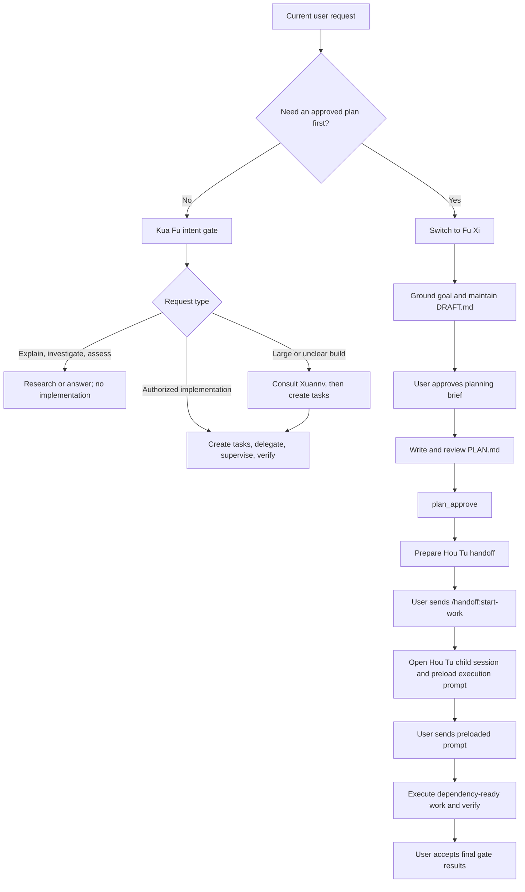

# Orchestration Guide

Panda Harness has two ways to organize work:

- **Kua Fu** handles build work in the current session. It classifies the current request, delegates bounded work, and verifies the result.
- **Fu Xi → Hou Tu** is the plan-first flow. Fu Xi produces an approved plan; two explicit user sends open and start a separate Hou Tu child session.

This guide is task-oriented. Runtime behavior and prompt contracts remain authoritative; see [Further reading](#further-reading). For the agent roster and mode-by-mode delegation matrix, use [Agent Orchestration Across Modes](agent-orchestration.md).

## Choose a workflow

| Use | When it fits | Session shape |
|---|---|---|
| **Kua Fu** (default/build) | The requested implementation is concrete enough to begin, or you want an investigation, explanation, or assessment before deciding | Stays in the current session |
| **Fu Xi → Hou Tu** (plan/execute) | You want an explicit plan-first path, the goal needs requirements work, or the work benefits from a reviewed dependency-aware plan | Fu Xi plans in the current session; Hou Tu executes in a child session |

Use `/mode fuxi` when you want the plan-first path. Kua Fu does not spawn Fu Xi or Hou Tu as subagents. For large or unclear build work, Kua Fu may consult `xuannv` for a tactical plan and continue in the same session.

## Decision and lifecycle

The workflow combines protocol requirements with runtime-enforced mechanics:

| Layer | What it controls |
|---|---|
| **Prompt/protocol** | Fu Xi's interview and reviews; Hou Tu's PLAN/Task synchronization, scheduling, delegation, and verification order; Kua Fu's routing and supervision |
| **Runtime** | Fu Xi's allowed write paths and guarded shell access; mode-scoped delegation authorization; approval state and prepared-handoff registration; child-session creation and `agent-mode: houtu` seeding |

The runtime does not independently prove that a prompt-level review or verification step occurred. The shipped runtime and mode prompts remain authoritative if this guide drifts.

## Plan with Fu Xi

1. **Enter plan mode.** Run `/mode fuxi`, then describe the desired outcome and constraints.
2. **Ground the request.** Fu Xi inspects relevant evidence, asks only unresolved questions, and maintains the resumable planning record in `local://DRAFT.md`. Fu Xi plans only; it does not implement directly or through a child agent.
3. **Approve the planning brief.** Fu Xi presents the proposed approach and unresolved owner decisions. Your explicit approval authorizes creation of one plan, not implementation.
4. **Produce the plan.** Fu Xi creates `local://PLAN.md`, adds decision-complete tasks, dependencies, verification, success criteria, and the final verification wave. The plan must stand alone because Hou Tu receives no interview context.
5. **Review the plan.** The planning protocol requires Di Renjie gap analysis. When `ulw-plan` marks review as required, fresh Yan Luo and independent Taishang reviewers must approve the same complete plan digest; editing the plan invalidates both receipts. The approval menu also offers its Yan Luo high-accuracy path. These are protocol gates, not runtime-proven transitions.
6. **Choose from `plan_approve`.** The interactive menu can open the system editor, use Plannotator when available, request Yan Luo high-accuracy review, or approve. Approval marks the review state and prepares the Hou Tu handoff.

Changing `PLAN.md` resets approval state when no browser review is pending. Refine the plan, then return to `plan_approve`.

## Approve and start execution

Approval prepares execution; it does **not** start it. The interactive handoff has two explicit user-send boundaries:

1. **Send `/handoff:start-work`.** After approval, Panda Harness preloads this command in the current editor. Send it to resolve the prepared handoff, open a child session, and seed that child with `agent-mode: houtu`.
2. **Send the execution prompt.** The child session opens with a deterministic prompt already in its editor. Review it if needed, then send it to begin Hou Tu execution.

Neither approval nor child-session creation auto-sends the execution prompt. The prepared handoff uses the approved plan's resolved path, disables generic conversation summarization, and tells Hou Tu to execute that plan.

## Execute with Hou Tu

Hou Tu conducts the approved plan rather than editing product files itself.

### Register and schedule work

- Hou Tu reads the exact approved plan path from the incoming goal.
- It creates one pi-task for each top-level plan task plus final gates F1–F4, records dependencies, and lists the resulting task graph.
- `PLAN.md` is the durable source of truth. Task state is its synchronized runtime mirror: `pending` → `in_progress` → parent-verified `completed`, followed by the matching checked plan row.
- Runnable work comes from resolved dependencies, not merely from wave labels. A task is serialized only for a named dependency, a file conflict, or a verification-state conflict.

### Delegate and supervise

- Independent implementation tasks launch as multiple **foreground** `Agent` calls in one response. They run concurrently while Hou Tu waits for all results.
- Background agents are only for non-blocking exploration or research, never implementation parallelism.
- Hou Tu delegates product-code, test-file, documentation, and git mutations. It retains PLAN, Task, and shared-notepad orchestration state.
- Workers receive bounded prompts and only relevant shared notes. Their summaries and notepad entries remain claims until Hou Tu verifies them.
- Recoverable failures resume the same agent session. Unresolved work stays `in_progress`; independent work may continue.

See [Agent Orchestration Across Modes](agent-orchestration.md) for worker roles and authorization.

### Verify and finish

Before checking off a task, Hou Tu inspects the changed files, the applicable diff, command output and exit status, diagnostics when applicable, and user-visible behavior when needed. Worker self-reports are not completion evidence.

After all implementation tasks pass, Hou Tu runs four final gates:

| Gate | Owner | Purpose |
|---|---|---|
| **F1** | Taishang | Plan-compliance audit |
| **F2** | Hou Tu parent | Code-quality review and final executable integration evidence |
| **F3** | Hou Tu parent | Manual QA for affected runnable user-visible surfaces |
| **F4** | Di Renjie | Scope-fidelity audit |

A rejection leaves the gate in progress and unchecked. Hou Tu repairs the responsible workstream and reruns every invalidated gate. After all four gates approve, Hou Tu shows their verdicts and waits for your explicit acceptance before declaring the plan complete.

## Build with Kua Fu

Kua Fu is the default workflow and remains in the current session.

1. **Classify the current message.** Explanation, investigation, comparison, and evaluation do not authorize edits. A direct implementation or fix request can proceed once scope and verification are clear.
2. **Gather only needed context.** Kua Fu inspects the repository and may delegate focused discovery or external research.
3. **Plan at the right scale.** Non-trivial work becomes pi-tasks. For large, sequential, or unclear work, Kua Fu may ask Xuannv for a tactical plan and convert it into tasks. This does not switch modes or create a Hou Tu session.
4. **Delegate bounded work.** Independent chunks may run in parallel; dependent work remains sequential. Kua Fu directly edits only tiny, local, low-risk changes when delegation has no advantage.
5. **Supervise continuity.** Kua Fu collects background results when notified, steers drifting work, and resumes salvageable sessions instead of duplicating them.
6. **Verify personally.** Kua Fu reads changed files, reviews the applicable diff, and runs the focused and integrated checks needed for the combined change before reporting completion.

If Kua Fu discovers that the work needs a durable, user-approved plan and clean execution context, switch explicitly with `/mode fuxi`.

## Troubleshooting

| Symptom | What to do |
|---|---|
| The plan is approved, but implementation did not start | Send the preloaded `/handoff:start-work` command. Approval only prepares the handoff. |
| The Hou Tu child session opened, but nothing is running | Send the preloaded execution prompt in the child session. Session creation does not auto-send it. |
| `/handoff:start-work` reports no prepared handoff | Return to the Fu Xi session, ensure `local://PLAN.md` is finalized, and approve it through `plan_approve` before trying again. |
| Plannotator is unavailable | Use the system-editor refinement option or another available approval-menu path. |
| A Hou Tu task stays `in_progress` | Check the reported verification or dependency failure. Failed work remains active until repaired and parent-verified; it is not checked off from a worker summary. |
| Work is running sequentially without an obvious reason | Hou Tu should name the blocking dependency, file conflict, or verification-state conflict. Independent implementation belongs in one foreground parallel batch. |
| Kua Fu is analyzing instead of editing | Make the current message explicitly authorize the intended implementation or fix and give a concrete scope. Kua Fu's authorization gate is turn-local. |
| You expected a child execution session from Kua Fu | Kua Fu stays in the current session. Switch to `/mode fuxi` for the Fu Xi → Hou Tu plan-first flow. |

## Further reading

- [Agent Orchestration Across Modes](agent-orchestration.md) — agent roster, delegation matrix, and cross-mode map
- [Modes Extension](../specs/modes.md) — shipped mode switching, restrictions, approval state, and handoff behavior
- [Mode-scoped Subagent Delegation](../specs/mode-scoped-subagent-delegation.md) — delegation authorization contract
- [Agent frontmatter](agent-frontmatter.md) — mode and agent configuration fields
- [Subagents extension](../../extensions/subagents/README.md) — `Agent` execution and supervision tools
