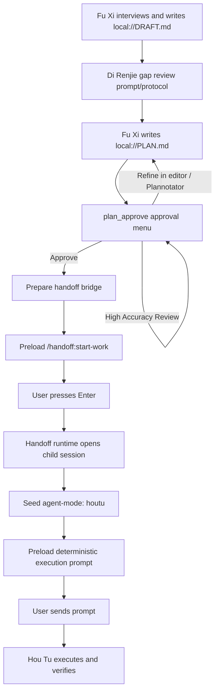

# Orchestration Flow

This document describes the current planning-to-execution lifecycle. It is descriptive, not a stronger guarantee than the runtime implements.

## Lifecycle

1. **Interview draft**
   - Fu Xi records the interview and research notes in `local://DRAFT.md`.
   - Plan-mode hooks restrict writes to `local://DRAFT.md` and `local://PLAN.md`, block built-in `bash`, and leave read-only shell inspection to `readonly_bash` when allowlisted.

2. **Di Renjie gap review**
   - Di Renjie review is part of Fu Xi's prompt/protocol.
   - It is not a runtime-enforced gate and does not use a completion tool.

3. **Plan write**
   - Fu Xi writes the execution plan to `local://PLAN.md`.
   - `local://PLAN.md` is saved in the planning session; the handoff prompt carries the resolved plan file path into the child session.

4. **Approval menu**
   - Fu Xi calls the single approval tool, `plan_approve`.
   - The tool supports two menu variants:
     - `post-gap-review`
     - `post-high-accuracy`
   - The menu can approve, request editor refinement, request Plannotator refinement, or return instructions for high-accuracy review.

5. **Approved handoff preparation**
   - Approval marks the in-session plan review state approved.
   - The modes extension prepares a handoff bridge for the current session and preloads `/handoff:start-work` into the editor.
   - The user must press Enter to send that command.

6. **Handoff command**
   - `/handoff:start-work` asks the handoff runtime for the prepared handoff args.
   - The runtime opens a new child session.
   - During child-session setup, it seeds an `agent-mode` entry with `mode: "houtu"`.
   - It preloads a deterministic execution prompt into the new editor and notifies the user to press Enter.
   - Execution starts only when the user sends that prompt.

7. **Hou Tu execution**
   - Hou Tu reads the approved plan path from the handoff prompt, creates pi-tasks for execution waves, delegates bounded work to subagents, verifies results, updates plan checkboxes, and continues until complete or blocked.

## Ownership by file

### `extensions/modes/src/index.ts`

Extension entry point for modes. It wires commands, hooks, the prepared handoff args resolver, and the `plan_approve` tool.

### `extensions/modes/src/plan-approval.ts`

Approval menu implementation. It owns:

- `post-gap-review` and `post-high-accuracy` menu variants
- editor refinement flow
- high-accuracy review instructions
- approval handoff callout

### `extensions/modes/src/plannotator.ts`

Modes-side Plannotator coordination. It owns:

- Plannotator availability checks
- starting direct browser reviews
- handling review decisions through the `onDecision` callback
- approved-plan handoff preparation
- restart recovery that clears stale pending browser review state

### `extensions/modes/src/plannotator-direct.ts`

Direct Plannotator package integration. It imports the installed browser-review module when available, probes for required functions/assets, starts browser review sessions, and resets its availability cache.

### `extensions/modes/src/hooks.ts`

Mode runtime hooks. It owns:

- Fu Xi write/edit restrictions
- Fu Xi built-in bash blocking
- delegation allow/block enforcement from mode frontmatter
- mode prompt injection
- session mode restoration
- plan state hydration
- plan-write review-state reset when no browser review is pending
- Plannotator review recovery on session start

### `extensions/handoff/index.ts`

Handoff extension entry point. It registers:

- `/handoff`
- `/handoff:start-work`
- the direct handoff bridge listener

### `extensions/handoff/runtime.ts`

Handoff runtime. It owns:

- `handoff:rpc:prepare` bridge registration
- prepared handoff lookup
- `/handoff:start-work` execution
- child session creation
- `agent-mode: houtu` seeding
- deterministic execution prompt construction
- optional generic handoff summarization for `/handoff`

### `agents/fuxi.md`

Fu Xi's planning protocol. It defines the interview draft workflow, Di Renjie review expectations, `local://PLAN.md` plan format, and the requirement to use `plan_approve` for post-plan decisions.

### `agents/houtu.md`

Hou Tu's execution protocol. It defines conductor behavior: read the plan, create pi-tasks, delegate one bounded task at a time, verify every result, update plan checkboxes, and continue through all waves.

## Boundary rules

- Plan mode prepares handoff only after approval.
- Approval does not directly start implementation.
- `/handoff:start-work` does not itself send the execution prompt; it prepares a child session and waits for the user.
- Execution begins in the child session only after the user sends the preloaded prompt.
- Di Renjie gap review is a prompt/protocol requirement, not a runtime state transition.
- The current flow does not reject later plan edits automatically after approval.
