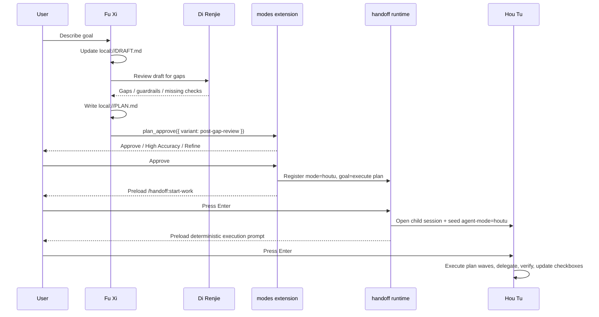
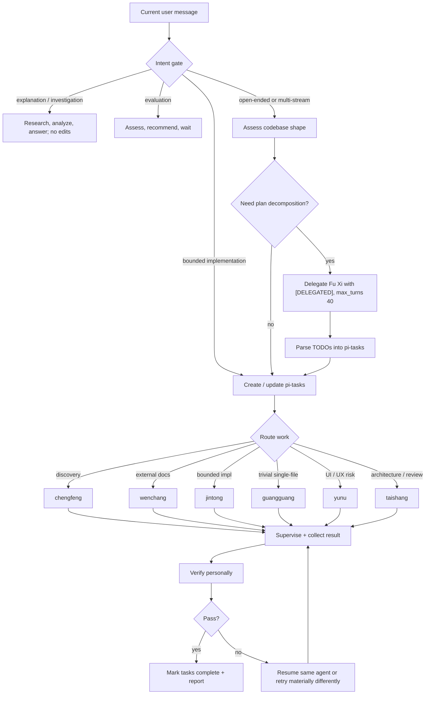
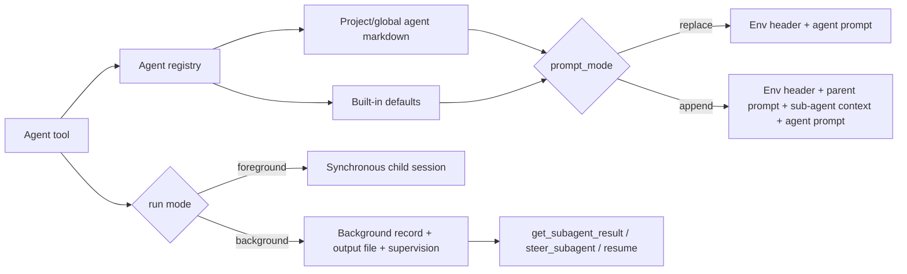

# Orchestration Flow

This document describes the repo's two orchestration workflows. It is descriptive, not a stronger guarantee than the runtime implements.

## Two workflows

```mermaid
flowchart LR
    U[User request] --> M{Mode / intent}

    M -->|Plan mode| F[Fu Xi: interview + plan]
    F --> D[Di Renjie gap review]
    D --> P[local://PLAN.md]
    P --> A[plan_approve]
    A -->|Approve| B[/handoff:start-work bridge]
    B --> H[Hou Tu child session]
    H --> E[Execute plan waves]

    M -->|Default build mode| K[Kua Fu: classify turn]
    K -->|answer / assess| R[Research or respond]
    K -->|bounded impl| T[Create pi-tasks + delegate]
    K -->|large / unclear| FP["Delegate Fu Xi in [DELEGATED] mode"]
    FP --> T
    T --> V[Verify changed files + checks]
```

- **Fu Xi + Hou Tu** is the plan-and-execute workflow. Fu Xi plans; Hou Tu executes the approved plan in a child session.
- **Kua Fu** is the default build workflow. Kua Fu stays in the current session, routes work to specialists, and verifies results.

## Workflow 1: Fu Xi + Hou Tu plan execution

Use this flow when the user enters plan mode or asks for a plan-first execution path. The modes extension defines the personas and the handoff path: Fu Xi drafts with Di Renjie review, `plan_approve` presents review choices, and approval prepares a Hou Tu handoff.



### Lifecycle

1. **Interview draft**
   - Fu Xi records the interview and research notes in `local://DRAFT.md`.
   - Plan-mode hooks restrict writes to `local://DRAFT.md` and `local://PLAN.md`, block built-in `bash`, and leave read-only shell inspection to allowlisted tools.

2. **Di Renjie gap review**
   - Fu Xi reads the draft, calls Di Renjie, and asks for missing questions, guardrails, assumptions, acceptance criteria, and edge cases.
   - This review is a prompt/protocol requirement. It is not a runtime-enforced state transition.

3. **Plan write**
   - Fu Xi writes `local://PLAN.md` with objectives, guardrails, verification strategy, execution waves, TODOs, and final verification gates.
   - The plan must contain enough references and acceptance criteria for an execution agent with no interview context.

4. **Approval menu**
   - Fu Xi calls `plan_approve`.
   - `post-gap-review` offers editor refinement, Plannotator refinement, Yan Luo high-accuracy review, and approve.
   - `post-high-accuracy` offers editor refinement, Plannotator refinement, and approve.

5. **Approved handoff preparation**
   - Approval marks the plan review state approved.
   - The modes extension prepares handoff args with `mode: "houtu"`, `summarize: false`, and a goal built from the plan path.
   - The current editor is prefilled with `/handoff:start-work`; implementation has not started yet.

6. **Handoff command**
   - `/handoff:start-work` asks the handoff runtime for prepared handoff args.
   - The runtime opens a child session, seeds `agent-mode: houtu`, preloads a deterministic execution prompt, and waits for the user to press Enter.

7. **Hou Tu execution**
   - Hou Tu reads `local://PLAN.md`, creates wave-level pi-tasks, initializes split notepads, and analyzes top-level task checkboxes.
   - For each plan task, Hou Tu delegates one bounded task to the right specialist. It does not implement product changes directly.
   - Hou Tu verifies every delegation with diagnostics, builds/tests where applicable, manual readback, plan-state checks, and hands-on QA when needed.
   - After verification, Hou Tu updates plan checkboxes and continues through final verification gates.

## Workflow 2: Kua Fu general build mode

Kua Fu is the default mode. It ships by orchestration, not by defaulting to direct edits. It only edits directly when the change is tiny, local, low-risk, and no specialist has an advantage.



### Lifecycle

1. **Intent gate**
   - Kua Fu classifies the current user message only.
   - Explanation, investigation, comparison, and evaluation requests do not trigger edits.
   - Concrete implementation proceeds only when scope is clear enough, no blocking specialist result is pending, and the work shape is known.

2. **Recon and planning**
   - For non-trivial codebase questions, Kua Fu starts `chengfeng` in the background unless the exact location is already known.
   - For external-library or pattern questions, it starts `wenchang` when outside context improves correctness.
   - For large, sequential, or unclear work, Kua Fu delegates to Fu Xi in `[DELEGATED]` mode, passes gathered context, sets `max_turns: 40`, and later converts Fu Xi's TODOs into pi-tasks.

3. **Task routing**
   - One bounded chunk goes to one specialist.
   - Independent chunks are split into parallel delegations.
   - Kua Fu routes discovery to `chengfeng`, external research to `wenchang`, bounded implementation to `jintong`, trivial single-file edits to `guangguang`, UI/UX risk to `yunu`, and architecture/review/debug escalation to `taishang`.
   - Kua Fu may delegate to Fu Xi for planning. It does not delegate to Hou Tu.

4. **Supervision**
   - Background agents must be polled with `get_subagent_result` and steered with `steer_subagent` if they drift or stall.
   - Failed delegated work should resume the same agent when useful, instead of spawning duplicate context.

5. **Verification**
   - Kua Fu reads changed files itself, runs diagnostics and focused checks, then confirms the request is fully satisfied.
   - Delegation does not count as verification.

## Shared subagent foundation

Both workflows depend on the subagent extension.



- `extensions/subagent/src/index.ts` registers `Agent`, background execution, resume, `get_subagent_result`, and `steer_subagent`.
- `extensions/subagent/src/custom-agents.ts` loads agent markdown from project `.pi/agents/*.md` and global `~/.pi/agent/agents/*.md`; project agents override global agents.
- `extensions/subagent/src/prompts.ts` builds prompts from agent frontmatter. `replace` gives the child a fresh prompt; `append` wraps the parent prompt with sub-agent context and the child instructions.
- `agents/fuxi.md`, `agents/houtu.md`, and `agents/kuafu.md` are the prompt contracts that define the workflows above.

## Ownership by file

### `extensions/modes/src/index.ts`

Modes entry point. It defines Kua Fu as default, wires mode commands/hooks, registers `plan_approve`, and exposes prepared handoff args for approved Fu Xi plans.

### `extensions/modes/src/plan-approval.ts`

Approval menu implementation. It owns `post-gap-review`, `post-high-accuracy`, editor refinement, Plannotator refinement, Yan Luo instructions, and approved handoff calls.

### `extensions/modes/src/plannotator.ts`

Modes-side Plannotator coordination. It prepares approved plan handoff, persists approval state, preloads `/handoff:start-work`, and registers a direct handoff for `mode: "houtu"`.

### `extensions/handoff/runtime.ts`

Handoff runtime. It owns prepared handoff lookup, `/handoff:start-work`, child session creation, `agent-mode` seeding, deterministic execution prompt construction, and optional generic handoff summarization.

### `extensions/subagent/src/index.ts`

Subagent runtime entry point. It registers `Agent`, handles foreground/background runs, exposes supervision tools, emits lifecycle events, and tracks background records.

### `extensions/subagent/src/custom-agents.ts`

Custom agent loader. It scans project and global agent markdown, parses frontmatter, and lets project agents override global agents.

### `extensions/subagent/src/prompts.ts`

Prompt builder. It renders `replace` and `append` prompt modes and injects skill/memory extras.

### `agents/fuxi.md`

Fu Xi's planning protocol. It defines the interview draft workflow, Di Renjie review, `local://PLAN.md` structure, approval flow, Yan Luo loop, and delegated planning mode.

### `agents/houtu.md`

Hou Tu's execution protocol. It defines plan-wave task registration, one-task-per-delegation execution, verification gates, notepad updates, retry/resume behavior, and final review gates.

### `agents/kuafu.md`

Kua Fu's build protocol. It defines intent gating, orchestration-first routing, Fu Xi delegated planning, subagent supervision, task usage, and verification requirements.

## Boundary rules

- Plan approval prepares execution; it does not start implementation.
- `/handoff:start-work` opens and preloads a child session; execution starts only after the user sends the preloaded prompt.
- Di Renjie and Yan Luo are prompt/protocol gates, not hard runtime state machines.
- Hou Tu executes approved plans; Kua Fu handles general build work in the current session.
- Kua Fu may ask Fu Xi for a delegated plan, but that path does not use the `/handoff:start-work` bridge unless the user is in the explicit Fu Xi approval flow.
- Both workflows rely on personal verification after delegation. Agent self-reports are never enough.
