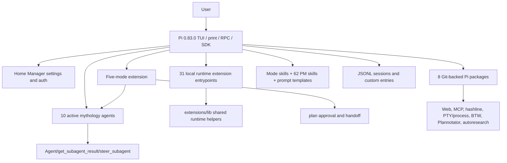
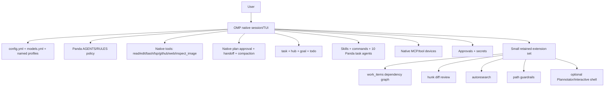

# OMP Harness Migration Assessment

- **Status:** draft
- **Date:** 2026-08-04
- **Decision under review:** replace Pi 0.83.0 as Panda Harness's runtime base with OMP 17.2.4.

## Executive decision

Migrate to OMP, but do not treat OMP's Pi compatibility aliases as the target architecture.

The migration is worthwhile because OMP already owns many of the hardest features this repository currently maintains as local Pi extensions: task agents, background jobs and peer messaging, plan approval, handoff, goals and todos, hash-anchored file tools, LSP, image inspection, GitHub resources, MCP, process supervision, service tiers, provider fallback, secret obfuscation, internal URLs, and richer approval policy. Keeping local copies of those features creates duplicate state machines and exposes the repository to Pi-internal API drift.

A direct installer retarget from `~/.pi/agent` to `~/.omp/agent` is not safe. The compatibility probe for this report loaded enough legacy code to reach a model turn, but six local extensions failed to load and several external packages failed or resolved dependencies inconsistently. OMP's legacy package aliases are useful for an incremental port; they are not evidence of behavioral compatibility.

The recommended target is:

1. **OMP-native core** for sessions, tools, agents, orchestration, plan approval, handoff, provider routing, security, and TUI behavior.
2. **A small Panda policy layer** for the mythology agent prompts, strict planning/delegation policy, sensitive-path guardrails, product-management assets, and repo-specific instructions.
3. **Thin OMP extensions only for genuinely distinct workflows**: the persisted dependency task graph, hunk comment round-trip, autoresearch, and any visual or interactive workflow that remains valuable after an OMP-native trial.
4. **No permanent Pi compatibility layer.** Port each retained extension to `@oh-my-pi/*`, update its manifest to `omp`, migrate every caller, then remove the old path.

This preserves outcomes rather than preserving every historical implementation.

## Scope and evidence

This report covers:

- the Pi capabilities inherited by the current harness;
- every local extension directory under `extensions/`, including non-runtime remnants;
- all active custom agents and all five modes;
- the eight Git-backed packages in the live Pi settings;
- skills, prompts, model routing, profiles, state, installation, testing, and security;
- an OMP-native target design, migration sequence, acceptance gates, rollback, and risks.

Evidence was taken from the repository's READMEs/specifications, the mirrored Pi documentation under `.agents/skills/pi-docs-playbook/source/`, the installed OMP documentation exposed under `omp://`, the live Pi settings, and compatibility probes. The OMP claims describe 17.2.4 as installed on 2026-08-04. Revalidate them when OMP is upgraded.

## 1. Current harness topology



### 1.1 Repository and live-install shape

- `install.sh` symlinks an explicit allowlist into `~/.pi/agent`; it does not mirror the whole repository.
- `AGENTS.md` and `settings.json` are intentionally skipped because Home Manager/Nix owns their live versions.
- `package.json` supplies Pi runtime packages, TypeBox, TypeScript, Vitest, and the extension test harness.
- Root tests have unit and real-Pi integration tiers. `test/extensions.smoke.test.ts` is the extension discovery/load gate.
- The repository contains **35 extension directories**:
  - **31 runtime entrypoints**;
  - `lib/`, which is shared code rather than an extension;
  - empty legacy/remnant directories `subagent/`, `btw/`, and `local-models/`.
- The live settings add **8 Git-backed Pi packages**.
- `agents/` contains **10 active mythology agents** plus three disabled compatibility definitions (`Explore`, `Plan`, `general-purpose`).
- The PM marketplace contributes **62 skills across 7 plugins** and **32 `/pm:*` commands**.

Sources: `install.sh`, `package.json`, `extensions/`, `agents/`, `extensions/pm-marketplace/README.md`, `test/`.

## 2. Pi baseline features inherited by Panda Harness

These are runtime capabilities supplied by Pi rather than local extension code. They are part of the current user experience and therefore part of migration acceptance.

| Capability | Current behavior | OMP adaptation |
|---|---|---|
| Interactive terminal UI | Multiline editor, streaming messages and tool calls, command completion, widgets, overlays, notifications, themes, keybindings, inline images | Use OMP's native TUI. Do not port Pi internal components unless a retained workflow cannot be expressed through OMP's public extension API. |
| Headless execution | `--print`/non-interactive runs | Use OMP `--print` and `--no-session`; include this in extension load probes. |
| SDK embedding | In-process TypeScript `createAgentSession`/`AgentSession` APIs | Port only repository tests or integrations that actually embed Pi. Use the OMP SDK rather than legacy imports. |
| RPC embedding | JSON protocol over stdin/stdout for external clients | Use OMP RPC/ACP contracts. Re-run any RPC-specific extension tests; `ctx.hasUI` alone is not proof that custom UI works. |
| Model/provider registry | Built-in and custom models, API/OAuth auth, provider selection, thinking levels, model changes | Move to OMP `models.yml`, `modelRoles`, `modelProviderOrder`, `enabledModels`, and `disabledProviders`. |
| Sessions | JSONL tree with IDs, parent links, branching, resume/continue, names, custom entries, tool/model/thinking changes | Use OMP's native JSONL session manager. Import old sessions only through a tested copy/validation path. |
| Compaction | Automatic compaction and branch summarization with configurable reserve/recent-token budgets and extension hooks | Keep current `reserveTokens: 16384` and `keepRecentTokens: 20000` in OMP config initially. Use native snapcompact/handoff rather than Pi compaction internals. |
| Built-in tools | File read/write/edit and shell execution | Use OMP `read`, `write`, line-anchored `edit`, and `bash`; remove local overrides when OMP has the required behavior. |
| Extension API | Event hooks, tools, commands, shortcuts, renderers, UI, provider registration, session entries | Retained extensions import `ExtensionAPI` from `@oh-my-pi/pi-coding-agent` and use only documented OMP surfaces. |
| Skills | Startup discovery, metadata in system context, on-demand skill loading | Use OMP native `skill://` and `/skill:<name>` discovery. |
| Prompt templates/commands | Markdown prompt expansion and extension commands | Convert static workflows to OMP command files or plugin command directories before writing an extension. |
| Packages | Packages can bundle extensions, skills, prompts, and themes | Use OMP package/plugin manifests and lockfiles; do not rely on the legacy `pi` manifest field after porting. |
| Custom agents | Frontmatter-defined subagents with prompt, tools, models, and delegation | Convert to OMP task-agent frontmatter and `task`/`hub`. |

Pi sources: `.agents/skills/pi-docs-playbook/source/packages/coding-agent/docs/{extensions,session-format,sessions,compaction,skills,prompt-templates,packages,sdk,rpc,tui,keybindings,providers,models}.md` and `.agents/skills/pi-docs-playbook/source/packages/agent/docs/{durable-harness,hooks}.md`.

## 3. Current live configuration features

The live `~/.pi/agent/settings.json` currently configures:

- default model `qwen2.5-coder:14b` through `llama-swap`;
- automatic compaction with 20,000 recent tokens and 16,384 reserved tokens;
- provider retry with 5 retries, 2-second initial delay, and 60-second maximum delay;
- steering delivery mode `all`;
- SSE transport;
- `github-diff` dark theme;
- 30,000 editor input lines and one line of padding;
- default project trust `always`, high permission level, quiet startup, no telemetry/full-auto telemetry, and tree filtering that hides tool entries;
- eight Git package sources;
- a broad local extension allowlist.

`tool_models.json` defines three cross-extension model roles:

- `summary.session`, consumed by `smart-sessions.summary`;
- `commit`, consumed by `boomerang.commit`;
- `guard.tool`, consumed by `smart-tool-guards.classifier`.

OMP has direct settings for compaction, retry delays, model fallback chains, steering/follow-up modes, themes, model roles, provider order, and tool approvals. The migration should hand-author and validate `config.yml`; it should not blindly rename the Pi JSON. OMP's automatic legacy migration only reads legacy files already under the active OMP user root, not `~/.pi/agent/settings.json`.

Sources: live `~/.pi/agent/settings.json`, `tool_models.json`, `omp://settings.md`, `omp://models.md`, `omp://config-usage.md`.

## 4. Current mode and orchestration features

The mode system is the highest-coupling part of the harness. It manages prompt injection, model-aware prompt variants, tool filtering, plan files, approval, mode switching, and handoff.

| Mode | Current contract | OMP-native adaptation |
|---|---|---|
| **Kua Fu 夸父 (`build`)** | Default implementation persona. Full build tools, direct answers, research and specialist delegation, model-family prompt variants, and `ulw` activation | Make the Panda build contract the top-level `AGENTS.md`/`RULES.md` policy. Use OMP `ultrathink`, `orchestrate`, and `workflow` magic keywords. No persistent custom mode is needed. |
| **Fu Xi 伏羲 (`plan`)** | Read-only planning; built-in mutating shell blocked; writes restricted to `PLAN.md`/`DRAFT.md`; interview and Plannotator review; Di Renjie gap review; explicit `plan_approve` | Use OMP native plan mode. It already restricts spawned agents and routes `/xdev/propose` through plan approval. Keep a Panda planning rule/command for the interview, Di Renjie review, and plan quality contract. Do not preserve a second plan state machine. |
| **Hou Tu 后土 (`execute`)** | Receives an approved plan in a child session, runs plan waves, delegates to Kua Fu workers, and verifies results | Use OMP's plan approval transition: approve and execute, approve with compacted context, or approve while retaining context. Native `task`/`hub` execute waves. Hou Tu becomes an execution instruction bundle, not a top-level runtime mode. |
| **Lu Ban 鲁班 (`luban`)** | Skill-first implementation discipline based on Superpowers workflows | Keep the skills. Invoke them through `/skill:*`, autoload on selected task agents, or a static `/luban` workflow command. Do not maintain persistent mode state solely to inject skills. |
| **Shen Nong 神農 (`pm`)** | Product-management persona, 62 gated PM skills, 32 `/pm:*` commands, and a 24-hour upstream update check | Package the PM skills and commands as OMP-native resources. OMP exposes only skill metadata until a skill is read, so static discovery is acceptable. Use a `shennong` task agent or explicit `/pm:*` commands rather than dynamic `resources_discover` mode gating. Keep the update check only if it remains useful. |

### Recommended new workflow

```mermaid
flowchart LR
    R[User request] --> D{Need a durable plan?}
    D -- no --> B[Panda build policy]
    D -- yes --> P[OMP native plan mode]
    P --> I[Interview and codebase evidence]
    I --> G[Di Renjie gap review]
    G --> Q[/xdev/propose]
    Q --> A{User approval}
    A -- revise --> P
    A -- execute --> E[OMP execution session/context]
    B --> T[task batch + hub supervision]
    E --> T
    T --> V[Orchestrator verification]
```

This removes the Fu Xi/Hou Tu state bridge while retaining its user-visible outcome: reviewed plan, explicit approval, clean execution context, supervised parallel work, and parent-owned verification.

Sources: `docs/specs/modes.md`, `docs/specs/orchestration-flow.md`, `docs/specs/mode-scoped-subagent-delegation.md`, `extensions/modes/README.md`, `omp://resolve-tool-runtime.md`, `omp://session-tree-plan.md`, `omp://task-agent-discovery.md`.

## 5. Active custom agent inventory and conversion

| Agent | Current specialty | OMP conversion |
|---|---|---|
| `yunu` — Yunu 玉女 | Frontend/UI implementation with Impeccable guidance and visual judgment | Retain as OMP task agent; tools `read,bash,edit,write,lsp,inspect_image` plus CodeGraph MCP; autoload `impeccable`. OMP's bundled `designer` may be used as a fallback, not a silent replacement. |
| `yanluo` — Yan Luo 阎罗 | Explicit, high-accuracy final plan reviewer | Retain as read-only OMP task agent. Map model chain and thinking levels; tools omit mutation. |
| `xuannv` — Xuannv 九天玄女 | Tactical planning advisor that may delegate reconnaissance/research/gap review | Retain; map `allow_delegation_to` to OMP `spawns`; replace `Agent/get_subagent_result/steer_subagent` with `task`/`hub`. |
| `wenchang` — Wen Chang 文昌 | External docs, web, GitHub, and library research with strict citations | Retain; use `web_search`, `read` for URLs, `github`, Context7/MCP tools, and no mutation. Local profile should disable this agent or its network tools. |
| `taishang` — Taishang 太上老君 | Architecture, hard debugging, security/performance consultation | Retain as read-only advisor task agent. OMP's native advisor can supplement it for continuous turn review. |
| `juling` — Juling 巨灵神 | High-reasoning bounded implementation worker | Retain as OMP task agent with no child `spawns`; map its model chain. |
| `jintong` — Jintong 金童 | Standard bounded implementation worker | Retain as OMP task agent with no child `spawns`. |
| `guangguang` — Guangguang 光光 | Lightweight one-file mechanical implementation | Retain or map to OMP `sonic`. Default recommendation: retain its stricter one-file contract because it is more specific than `sonic`. |
| `direnjie` — Di Renjie 狄仁杰 | Pre-finalization plan gap analyzer | Retain as read-only task agent and call from the Panda planning workflow before `/xdev/propose`. |
| `chengfeng` — Cheng Feng 乘风 | Fast read-only repository reconnaissance | Retain or map to OMP `scout`. Default recommendation: retain while prompt behavior is compared, then remove it only if `scout` meets the same evidence contract. |

Delete the disabled `Explore.md`, `Plan.md`, and `general-purpose.md` files during final cutover; OMP already bundles `scout`, `task`, `reviewer`, `designer`, `librarian`, and `sonic`.

### Frontmatter mapping

| Pi field | OMP field/action |
|---|---|
| `display_name` | `name` plus a readable name in the body; OMP lookup uses exact `name`. |
| `description` | `description`. |
| comma-separated `model` chain | OMP agent model patterns plus per-spawn fallbacks; also define role/model fallback chains under `retry.fallbackChains`. |
| `thinking` embedded in model selector | `thinkingLevel` or model selector suffix. |
| `builtin_tools` + `extension_tools` | one OMP `tools` list using final native/MCP names. |
| `allow_delegation_to` | `spawns`. |
| `allow_nesting` | explicit `spawns` and OMP recursion-depth settings. |
| `preload_skills` | `autoloadSkills`. |
| `discover_skills: false` | omit broad skill tools/context; use explicit autoload list and OMP discovery settings. |
| `persist_session: true` | native task lifecycle/session persistence; no custom field. |
| `prompt_mode: system_instructions` | agent Markdown body as `systemPrompt`. |
| `extensions: true` | no direct equivalent; list the exact tools. |

Important: OMP task agents are rediscovered at execution time, plan mode applies an effective read-only policy to child agents, and subagents can receive their own model fallback chain. Validate every converted agent through `/agents` and one real `task` call.

Sources: `agents/*.md`, `extensions/lib/agent-frontmatter.ts`, `omp://task-agent-discovery.md`, `omp://settings.md`.

## 6. Local extension feature-by-feature disposition

**Disposition vocabulary**

- **Native:** remove the local extension after migrating configuration/callers.
- **Thin port:** keep the behavior, but rewrite against documented OMP APIs.
- **Redesign:** preserve the outcome through a different OMP workflow.
- **Retire:** intentionally remove obsolete or empty code.

| Local surface | Features currently supplied | OMP adaptation | Disposition / cutover priority |
|---|---|---|---|
| `ask` | One or more tabbed questions, single/multi select, descriptions, recommended option, optional Other/free text, live widget, `user-prompted` event | Use native `ask`. OMP always supplies the Other editor; it has no caller-facing `allowOther` switch. Migrate schemas and accept that deliberate difference. | **Native — P0** |
| `better-bash-tool` | Bash override with streaming, timeout, renderer, and controlled execution | OMP `bash` already supports cwd/env, PTY, streaming, async jobs, timeouts, and output artifacts. Long-lived processes belong in `hub`. | **Native — P0** |
| `boomerang` | Autonomous branch run, collapse/summarize back to anchor, rethrow loops, chains, auto-wrap, commit shortcut, agent-callable tool | Replace ordinary use with isolated `task`, native handoff/compaction, `loop`, and commit skill/command. Native task isolation keeps worker context out of the parent, which removes most need for branch collapse. Port only if anchor/rethrow semantics prove uniquely valuable. | **Redesign — P2** |
| `btw` | Empty local support directory for the externally installed BTW package | See external-package table. Remove the empty local remnant. | **Retire local remnant** |
| `caveman` | Session/global terse-output levels; prompt injected into top-level and spawned agents; status UI | Use the OMP-discovered `caveman` skill and, if a persistent default is required, a concise rule/config contribution. Explicitly autoload it on agents that must inherit it. | **Native/rule — P2** |
| `clauderock` | Anthropic 402/429 failover to Bedrock, model ID mapping, sticky fallback state, health/test commands, status | Configure native Bedrock, `retry.modelFallback`, model/provider wildcard fallback chains, cooldown/revert policy, and AWS auth. OMP already supports `amazon-bedrock`. A small diagnostics command is optional; do not override the Anthropic provider. | **Native config — P0** |
| `codegraph` | Eight CodeGraph MCP proxy tools, marker-gated init, timeouts/retry, project-root resolution, same-project serialization, prompt guidance | Configure CodeGraph as native MCP/tool-device integration and keep CodeGraph-first instruction in policy/skill. Native MCP has deferred loading, reconnect, resources, prompts, and tool refresh. | **Native MCP — P0** |
| `diff` | `/diff` variants, hunk TUI handoff, inline comment harvesting, agent-narrated PR walkthrough sidecar | OMP has GitHub/PR diff access but not this hunk round-trip. Port command, temporary tool enabling, TUI suspend/resume, and comment follow-up to OMP. | **Thin/full port — P1** |
| `direnv` | Loads/reloads project environment for spawned tools and shows status | First verify OMP's inherited shell snapshot in a direnv project. If not equivalent, port the existing session hook as a small environment extension; avoid mutating global process env after session start. | **Thin port if needed — P1** |
| `fast` | `/fast` toggles OpenAI priority and Anthropic fast payload/header with eligibility checks and footer state | Use OMP provider service-tier settings/runtime support. Add a `/fast` command only if the single-toggle UX is still preferred. | **Native config — P1** |
| `filter-outputs` | Regex redaction of keys, tokens, auth headers, database URLs, private keys and secret files | Enable OMP `secrets.enabled`; translate regexes into `secrets.yml`. Keep sensitive-file path blocking in the guardrail extension because secret obfuscation is not a path authorization boundary. | **Native + guardrail — P0** |
| `github-fs` | `pr://`, `issue://`, `github://`; pagination, diffs, cache, multi-account `gh` auth, read-only enforcement | OMP natively implements `pr://` and `issue://` plus GitHub search/PR tools. It does not document `github://`; use native URL `read`, `github` search, or a narrow read-only protocol resolver if remote tree/file access remains necessary. | **Mostly native; optional thin `github://` — P1** |
| `goal` | Persistent single objective with create/get/resume/complete/drop and token budget | Use native `goal`. Migrate only active state if needed; do not load both tools. | **Native — P0** |
| `handoff` | Summarized child session, mode-targeted handoff, temp-file export, no-summary option, approved-plan start-work bridge | Use OMP `/handoff`, plan approval transitions, session naming, and optional handoff artifact persistence. Replace `/handoff:start-work` with native plan approval. Add an export command only if out-of-process temp-file handoff is still used. | **Native/redesign — P0** |
| `init` | `/init-deep` and `/init-dox` prompt workflows | Convert the prompt templates to OMP commands. No runtime extension is needed unless follow-up dispatch cannot be expressed as a command. | **Static command port — P1** |
| `inline-skills` | `$skill` invocation/completion and custom skill transcript component | Use `skill://` and `/skill:<name>`. OMP owns discovery and presentation. | **Native — P1** |
| `lib` | Shared model resolution, status/rendering, tool output, logging, clipboard, agent frontmatter, event helpers | Delete helpers made obsolete by native features. Move retained helpers beside their owning extension or into a much smaller OMP-specific library. Never retain wrappers around removed Pi internals. | **Refactor support code — P0/P1** |
| `local-models` | Empty test-only remnant | Define local providers/models in OMP `models.yml`; remove the directory. | **Retire** |
| `lsp` | Unified LSP tool, server lifecycle/config, diagnostics/navigation/code actions, status/restart | Use OMP's native `lsp`, including rename, references, diagnostics, capabilities, raw requests, and lazy process management. Migrate Home Manager config into OMP's supported settings; remove Pi-specific `.pi/lsp.json` assumptions. | **Native — P0** |
| `modes` | Five personas, model prompt variants, tool filters, plan storage/review/approval, mode commands/shortcut, handoff bridge | Replace with OMP build policy, native plan mode, plan approval, task agents, command/skill workflows, and PM resources as described above. Keep a small enforcement hook only if agent-type authorization must vary beyond OMP's native plan-mode restrictions. | **Redesign — P0** |
| `multimodal-look` | `look_at` local/base64 images, dedicated vision model chain, cwd/path/MIME/size safety, isolated no-tool child | Use native `inspect_image` and `modelRoles.vision`. It accepts local images, enforces image limits and returns focused text. Retain a wrapper only for base64 input or stricter cwd confinement if those are used. | **Native — P1** |
| `pm-marketplace` | 62 skills, 32 commands, Shen Nong gating, upstream update check | Package resources under OMP-native `skills/` and `commands/`; keep provenance. Static metadata discovery replaces dynamic `resources_discover`. Optional thin update checker. | **Resource conversion — P1** |
| `profiles` | Runtime provider allowlists for default/opencode/local; model force-switch; session persistence; offline guards; `/profile` commands and CLI flag | Use OMP named profiles: `~/.omp/profiles/<name>/agent`, `omp --profile`, `OMP_PROFILE`/`PI_PROFILE`. Profiles uniformly isolate config, agents, sessions, state, and auth. Put offline policy in the local profile. In-session profile switching is intentionally removed because OMP profile roots are process-scoped. | **Native config — P0** |
| `qol` | Custom header/footer, prompt URL widget, session copy ID, exit command, write renderer | OMP already owns status line, startup, tool rendering, session naming, and shutdown. `setHeader`/`setFooter` are legacy no-ops in OMP. Keep only a prompt-URL widget or session-copy command if still missing after trial. | **Mostly retire — P2** |
| `queue-steer` | Visible steering/follow-up timeline, row editing, pause/promote controls, settings reload | Use native steering and follow-up queues plus `steeringMode`, `followUpMode`, and `interruptMode`. Do not patch the editor for a duplicate queue. | **Native — P1** |
| `smart-tool-guards` | Scoped guard for native built-in `bash`: deterministic danger checks, strict model classification for deferred commands, and hidden trusted injection for protected read-only agents | Prefer no `bash` where OMP-native read/search tools cover the workflow. If guarded CLI access remains required, port the scope policy and classifier against documented OMP hooks while preserving native bash execution. The guard is authorization policy, not a shell sandbox. | **Thin port only for required CLI coverage — P0** |
| `second-opinion` | External `codex review`, session-scope selection, cancellation, verdict message, address-comments prompt | Use OMP `reviewer` task agent or native advisor for most reviews. Retain an OMP command/tool only if an independent Codex CLI verdict is a required property. | **Redesign/optional port — P1** |
| `session-local` | Agent-tree-scoped `local://` read/write/edit storage and exported storage helpers | Use native `local://`; OMP's internal router and task artifacts already understand it. Validate parent/child sharing and traversal protection before removing the extension. | **Native — P0** |
| `smart-sessions` | LLM-updated session names, debounce/resummary, manual update/clear/cost, optional widget | Use OMP native session naming and `modelRoles.tiny`. Keep a cost command only if native session UI does not expose equivalent information. | **Native — P1** |
| `subagent` | Empty predecessor directory | Remove after confirming no installer reference. | **Retire** |
| `subagents` | Parallel/background agents, queueing, agent tree, persistent sessions, steering, result retrieval, artifacts, widgets/viewer, model chains, output files, mode policy | Replace `Agent`, `get_subagent_result`, and `steer_subagent` with OMP `task` and `hub`. OMP adds batch spawning, async jobs, peer messaging, revival, isolated workspaces, merge/apply modes, lifecycle status, and `agent://`/`history://` artifacts. | **Native — P0** |
| `tasks` | Persistent `Task` graph with batch create/update, owners, metadata, bidirectional blockers, ready/running/blocked views, memory/session/project scopes, widget, RPC, and file storage | OMP `todo` is phased and session-persistent but does not replace the dependency graph/owner/metadata contract. Usage is real: `.pi/tasks/` contains many non-empty histories. Port as a distinct `work_items` tool to avoid confusion with native `task`; add a read-only importer for schema v2 state. | **Full port — P0/P1** |
| `thinking-steps` | Collapsed/summary/expanded semantic thinking renderer, project/global preference, Alt+t, live indicator | Trial OMP's native thinking rendering first. If semantic step parsing is still desired, port only through documented renderer hooks; do not prototype-patch OMP internal `AssistantMessageComponent`. | **Optional redesign — P2** |
| `tools` | Interactive per-branch tool enable/disable with fuzzy search and immediate active-tool changes | Use OMP `/settings`, tool approval policy, agent tool lists, and native mode filtering. Add a command only if branch-scoped toggling is a demonstrated need. | **Native — P1** |
| `ulw` | Model-family-specific ultrawork prompt activated by `ulw`/`ultrawork`, Kua Fu gating, transcript banner | Use OMP built-in `ultrathink` and `orchestrate` magic keywords plus the orchestration policy. If the exact OmO prompt is required, make it a skill, not an event-driven extension. | **Native/skill — P1** |
| `guardrails.json` + Home Manager hook | Blocks reads of SSH keys, cloud/GPG config, agent auth/config and other sensitive paths | Port the path policy to an OMP `tool_call` guard or native hook. Add `~/.omp` paths. Keep OMP secret obfuscation enabled as a separate outbound-data control. | **Thin security port — P0** |

## 7. External Git package inventory

The live Pi settings install these packages from Git. They need an explicit OMP decision; a successful legacy import is not sufficient.

| Package | Current features | OMP adaptation |
|---|---|---|
| `mavam/pi-mcporter` | Stable MCP proxy; server/tool discovery, search/describe/call, optional native tool exposure, auth/error hints | Prefer OMP native MCP discovery, deferred tools, resources, prompts, reconnect, refresh, and tool devices. Retain mcporter only for a server whose progressive proxy semantics materially reduce exposure and are not reproduced by OMP. |
| `RimuruW/pi-hashline-edit` | Hash-anchored read/edit overrides with stale-anchor rejection and mutation queue | Remove. OMP's native `read` and line-anchored `edit` already provide content tags and stale edit rejection. The package currently requests a legacy export OMP does not expose. |
| `davebcn87/pi-autoresearch` | Autonomous experiment loop with isolated worktree, metric tracking, keep/discard, resume, hooks, logs, and skills | Retain as an OMP extension/plugin after manifest/import conversion. An isolated direct load probe reached a successful OMP model turn, but aggregate package loading exposed dependency-resolution risk; add real loop smoke coverage. |
| `nicobailon/pi-web-access` | Multi-provider web search, parallel search, content extraction, GitHub/PDF/video/YouTube support, Gemini browser-cookie mode, curator UI | Prefer OMP `web_search`, URL `read`, built-in browser, GitHub, PDF/media skills, and MCP. Retain only a provider/extraction path not covered by OMP. |
| `nicobailon/pi-interactive-shell` | Observable PTY overlay, attach/takeover, monitoring, named sessions, input control, background shell workflow | OMP `hub` provides supervised long-running PTY processes, logs, send, signals, restart, readiness, and shared project scope. It does not duplicate the modal takeover overlay. Keep/port only if human interactive takeover is important. |
| `aliou/pi-processes` | Background process manager with start/list/log/pin/stop UI and shell interception | Remove in favor of `hub` process operations and native bash async jobs. |
| `dbachelder/pi-btw` | Side conversation/subsession, contextless tangent, modal viewer, thread injection or summary back to main | Use an async `task` agent and `hub` message/result retrieval for non-blocking side analysis. Port only if the modal threaded conversation itself is required. |
| `backnotprop/plannotator` | Browser-based plan review, annotations, message annotation, code/PR review, HTML artifacts | OMP native plan preview/approval is the default replacement. Browser annotation is not native parity. If it is required, port Plannotator as a first-class OMP plugin and keep its web server/browser integration isolated; otherwise retire it after plan-mode acceptance testing. |

## 8. Skills, prompts, commands, and package adaptation

### 8.1 Skills

- Keep authored skill content under one skill per directory with `SKILL.md`.
- Install common skills under `~/.omp/agent/skills` or an OMP plugin; install profile-specific skills under the named profile root when isolation is intended.
- Convert agent `preload_skills` to `autoloadSkills` only for skills that must always shape that specialist.
- Leave the remaining skill catalog on demand through `skill://`.
- Preserve PM provenance and upstream pins. Resource conversion must not hand-edit generated/vendored content without updating provenance.

### 8.2 Commands and prompt templates

Use static OMP command files for workflows that only inject a prompt:

- `/init-deep`, `/init-dox`;
- `/luban` if a convenience entry is desired;
- the 32 `/pm:*` commands;
- any retained plan-review or review-request prompt.

Use an extension command only when the workflow needs runtime state, UI, process control, or callbacks—for example hunk comment harvesting or autoresearch.

### 8.3 Package manifests

For every retained package:

- change peer/runtime imports from `@earendil-works/pi-*` to `@oh-my-pi/pi-*`;
- add the OMP manifest field (`omp.extensions`, skills, commands, or plugin manifest as appropriate);
- remove the `pi` manifest after every consumer has cut over;
- pin upstream provenance and local tweaks;
- install through OMP's plugin/package mechanism or the repository's Nix-managed symlink allowlist;
- assert that the package's extension entry is a file/directory OMP actually resolves—do not rely on `"./"` behavior without a test.

Sources: `omp://extensions.md`, `omp://extension-loading.md`, `omp://custom-tools.md`, `omp://skills.md`, `omp://user-facing-packages.md`, `omp://mcp-runtime-lifecycle.md`.

## 9. OMP target architecture



### 9.1 Recommended repo layout

Keep the repository's top-level shape; do not add a parallel `omp/` source tree.

```text
pi-config/                       # repository name may remain until a separate rename decision
├── agents/                     # OMP task-agent frontmatter
├── commands/                   # static OMP commands, including pm commands
├── extensions/                 # only retained OMP-native extensions
├── modes/                      # skill/prompt assets only; no custom runtime mode state
├── themes/                     # OMP-valid theme JSON
├── docs/
├── scripts/
├── test/                       # OMP unit/integration/load tests
├── package.json                # @oh-my-pi dependencies
└── install.sh                  # OMP/profile-aware allowlist installer
```

Target live roots:

```text
~/.omp/agent/                   # default profile
~/.omp/profiles/opencode/agent/
~/.omp/profiles/local/agent/
```

Common assets may be linked into each profile, while config/auth/session state remains profile-owned. Project-level `.omp/` assets remain shared across profiles by working directory.

### 9.2 Suggested retained extension set

Required by current behavior:

- OMP path guardrails;
- `work_items` dependency graph plus state importer;
- hunk diff/review bridge;
- possibly direnv environment capture if native shell behavior fails its scenario test;
- PM update checker only if desired.

Distinct opt-in workflows:

- autoresearch;
- Plannotator browser annotations;
- interactive-shell takeover overlay;
- independent Codex CLI second opinion;
- semantic thinking-step renderer.

Everything else should be native, static resources, or removed.

## 10. Model, provider, profile, and retry migration

### 10.1 Model roles

Map current behavior into OMP roles:

| Current use | OMP role/config |
|---|---|
| top-level default | `modelRoles.default` |
| cheap titles/session summaries | `modelRoles.tiny` and/or `smol` |
| deep planning | `modelRoles.plan` |
| design specialist | `modelRoles.designer` |
| commit generation | `modelRoles.commit` |
| ordinary tasks | `modelRoles.task` |
| architecture/continuous review | `modelRoles.advisor` |
| image analysis | `modelRoles.vision` |

Translate `summary.session` into `tiny`/`smol` and `commit` into `modelRoles.commit`; delete `tool_models.json` after every caller is migrated.

### 10.2 Fallback chains

OMP supports ordered fallback chains by role, exact model, and `provider/*`, with cooldown and revert policy. Preserve current per-agent chains as agent model patterns and define shared role chains under `retry.fallbackChains`. Unlike the old profile filter, OMP can react to request failures as well as initial availability.

The `clauderock` behavior should become a provider fallback chain, for example Anthropic direct to Amazon Bedrock, rather than a custom provider override. Validate model-ID equivalence against OMP's installed catalog; do not carry the extension's response-ID rewriting into the new architecture.

### 10.3 Provider profiles

Create three OMP named profiles:

| OMP profile | Providers/policy |
|---|---|
| default | Anthropic, OpenAI/OpenAI Codex, Amazon Bedrock, Google; normal network tools |
| opencode | OpenCode Go and its intended fallbacks |
| local | llama-swap only; network tools/agents disabled; offline system rule |

Differences from the Pi extension are intentional:

- profile choice occurs at process start through `omp --profile`, `OMP_PROFILE`, or `PI_PROFILE`;
- the whole user root, including auth and sessions, is isolated;
- no `/profile` in-session mutation;
- common agents/skills/extensions must be installed into each profile or supplied at project/plugin scope.

This is safer than changing provider visibility inside a live session.

## 11. Security and trust model

OMP's default approval mode is `yolo`; do not inherit that accidentally during migration.

Recommended migration baseline:

```yaml
tools:
  approvalMode: write
secrets:
  enabled: true
```

Then set explicit per-tool policy for browser/computer/shell/external mutation as needed. Decide whether the final trusted default returns to `yolo` only after the path guardrail and profile restrictions pass.

Controls are complementary:

1. **Tool approvals** decide whether read/write/exec calls require permission.
2. **Path guardrails** reject sensitive file targets even when a read tool is generally allowed.
3. **Secret obfuscation** prevents known secret values and configured regex matches from leaving in model-bound text.
4. **Agent tool lists** make read-only agents structurally unable to mutate.
5. **Named profiles** keep offline and provider-specific credentials/state separate.

Port `guardrails.json` and the Nix-managed hook before enabling repository extensions. Add OMP auth/config paths, preserve SSH/GPG/cloud patterns, and test symlink/path-normalization bypasses. Do not treat `smart-tool-guards` or approval prompts as a confidentiality sandbox.

Sources: `extensions/guardrails.json`, `extensions/filter-outputs/README.md`, `extensions/smart-tool-guards/README.md`, `omp://approval-mode.md`, `omp://secrets.md`.

## 12. Session and runtime-state migration

### 12.1 State classification

| State | Migration action |
|---|---|
| Pi session JSONL | Preserve source. Import copies only after structural validation and an OMP resume/append test. Unknown custom entries should remain inert, not be rewritten blindly. |
| Pi auth/OAuth store | Do not copy blindly. Prefer OMP login/auth broker or environment credentials. Validate provider by provider. |
| Active goals | Convert the active objective into OMP goal state or close it in Pi before cutover. |
| `.pi/tasks/` graph files | Import schema-v2 snapshots into the retained `work_items` store; keep a manifest from old session ID to imported store. Never mutate originals. |
| `~/.pi/agent/local/` | Copy only if native OMP `local://` scope IDs match imported session IDs; otherwise archive and import files on demand. |
| Subagent session/output files | Keep as read-only archive. OMP task agents use different lifecycle/IDs; do not advertise old agents as resumable. |
| `caveman.json` | Translate default level into OMP rule/skill config, then archive. |
| `session-summary.json` | Translate chosen model into `modelRoles.tiny`; native naming replaces counters/debounce state. |
| `tool_models.json` | Translate into `modelRoles` and `retry.fallbackChains`. |
| `clauderock-state.json` | Do not migrate sticky exhausted state; OMP retry/cooldown starts fresh. |
| `github-fs-cache/` | Drop; it is a derived cache. |
| extension update caches | Drop; they are derived. |
| theme | Copy after OMP schema conversion. |

### 12.2 Session compatibility warning

Pi and OMP both use versioned JSONL session trees, and OMP includes legacy session migrations, but this report did not prove bulk cross-root Pi session import. A fresh Pi fixture attempt could not complete because the configured local provider timed out. Treat session compatibility as an explicit migration gate, not an assumption.

The importer must:

1. enumerate without modifying `~/.pi/agent/sessions`;
2. parse every line and report version/entry types;
3. copy one representative session to a disposable OMP root;
4. open, resume, branch, append a turn, and reopen it with OMP;
5. test sessions containing mode/profile/task/subagent custom entries;
6. produce a checksum manifest and per-file result;
7. copy accepted files into the target profile only after validation.

## 13. Theme and UI migration

`themes/github-diff.json` is close to OMP's schema but is not valid as-is. OMP 17.2.4 requires additional tokens absent from the Pi theme:

- `statusLineBg`;
- `pythonMode`;
- thirteen status-line segment colors (`statusLineSep`, `statusLineModel`, `statusLinePath`, git state colors, context/spend/output/cost/subagent colors).

Add these tokens using the existing palette, update `$schema`, then validate in OMP and exercise markdown, tool pending/success/error, diffs, thinking levels, bash/python mode, status line, and narrow terminal widths.

Do not port the QoL header/footer. OMP documents legacy `setHeader`/`setFooter` as no-ops and owns its status line. Add only narrowly missing UI behavior through supported widgets/renderers.

Sources: `themes/github-diff.json`, `omp://theme.md`, `omp://extensions.md`.

## 14. Extension API conversion hazards

The OMP port keeps much of Pi's extension shape, but the following observed assumptions are broken:

| Pi-era dependency | OMP result/required change |
|---|---|
| `DEFAULT_COMPACTION_SETTINGS` from legacy coding-agent package | Not exported through the OMP legacy alias. Use resolved OMP settings/native compaction. |
| `serializeConversation` from Pi internals | Not exported through the alias used by `modes`/handoff code. Use native plan/handoff/session APIs. |
| `SkillInvocationMessageComponent` | Not exported. Use native skill presentation. |
| `withFileMutationQueue` | Not exported. Use OMP native anchored file tools; retained custom mutators need their own documented serialization strategy. |
| `settingsManager.reload()` | Not available on the object seen by `queue-steer`. Use native queue/settings behavior; avoid runtime reload assumptions. |
| custom header/footer ownership | Legacy API is a no-op. Use OMP status/UI packages or supported widgets. |
| CommonJS `require()` of an async module | Rejected in `github-fs`. Convert to ESM and/or native protocols. |
| package manifest extension path `"./"` | Aggregate Plannotator load resolved it as a directory where a file was expected. Use an explicit tested entrypoint/OMP manifest. |

A TypeScript compile against legacy declarations is not enough. Every retained extension needs a load test and a behavioral scenario.

## 15. Compatibility probe results

Commands were run from this repository with OMP 17.2.4.

### 15.1 Positive result

An isolated load of the `pi-autoresearch` extension reached a model turn and returned `OK`:

```text
omp --no-extensions -e <pi-autoresearch-extension> --print --no-session "Reply only OK"
```

This proves only that its startup path can load in isolation through OMP's compatibility layer.

### 15.2 Local-extension aggregate result

Loading the repository extension set reached `OK` but logged failures for:

- `boomerang`: missing `DEFAULT_COMPACTION_SETTINGS`;
- `modes`: missing `serializeConversation`;
- `qol`: runtime object initialization error;
- `inline-skills`: missing `SkillInvocationMessageComponent`;
- `github-fs`: CommonJS `require()` of async module;
- `queue-steer`: missing `settingsManager.reload()`.

The command still exited successfully. Therefore the new smoke test must fail on extension-load diagnostics, not only process exit code or final model text.

### 15.3 Package aggregate result

A combined legacy package load exposed:

- `pi-hashline-edit`: missing `withFileMutationQueue`;
- `pi-autoresearch`: package-context dependency resolution failure for `@earendil-works/pi-ai` despite its isolated startup success;
- `pi-btw`: missing legacy package dependency in that load context;
- Plannotator: extension directory/entrypoint resolution failure.

These are migration evidence, not definitive package audits. Each retained package still needs an isolated explicit-entry load and behavior test after its OMP manifest/import conversion.

## 16. Migration sequence and gates

Do not modify the live Pi install during the first five phases. OMP and Pi roots are separate, so rollback remains the existing `pi` command.

### Phase 0 — Freeze contracts and fixtures

Deliverables:

- record the current extension, command, agent, mode, provider, and state inventory from this report;
- capture representative non-secret fixtures for sessions, task graphs, agent frontmatter, tool output, and mode transitions;
- define the scenario matrix in section 17;
- add a load gate that treats any OMP extension-load warning/error as failure.

Gate:

- every P0 feature has a fixture or executable scenario;
- original runtime state remains untouched and checksummed where copied.

### Phase 1 — Establish OMP foundation

Deliverables:

- replace root runtime dependencies with pinned `@oh-my-pi/*` packages;
- create OMP-native test stubs/harness usage;
- build an OMP/profile-aware installer targeting the three user roots;
- author `config.yml`, `models.yml`, MCP config, secrets config, and converted theme;
- port path guardrails first;
- add clean `--no-extensions` and explicit-extension load probes.

Gate:

- OMP starts with no legacy Pi imports, no extension-load diagnostics, correct model/profile selection, valid theme, and working path/secret controls.

### Phase 2 — Replace duplicated platform extensions

Remove local implementations only after their native scenario passes:

- `ask`, bash override, hashline package, LSP, CodeGraph adapter, goal, session-local, subagents, process manager, queue, web-access, filter-outputs, smart sessions, tools UI, and fast provider interceptor;
- translate callers and prompt tool names at the same time;
- delete obsolete shared-lib helpers created solely for those extensions.

Gate:

- no prompt, agent, command, test, or installer references a removed tool/extension;
- native behavior passes the matching scenario.

### Phase 3 — Convert agents and orchestration

Deliverables:

- convert all ten active agent definitions;
- replace `Agent/get_subagent_result/steer_subagent` with `task`/`hub` in prompts and skills;
- replace five runtime modes with build policy, native plan mode, approval transition, Lu Ban skill workflow, and Shen Nong PM resources;
- retain fail-closed planning restrictions and read-only specialist tool lists;
- remove disabled compatibility agents.

Gate:

- build, plan, approval/revision, execution handoff, parallel delegation, steering, failure, and verification scenarios pass;
- plan mode cannot mutate through direct tools or a spawned worker;
- each agent resolves a valid model chain in all three profiles.

### Phase 4 — Port distinct workflows

Port in isolation:

1. `work_items` task graph and importer;
2. hunk diff/comment round-trip;
3. static init and PM commands/skills;
4. autoresearch;
5. optional independent Codex review, Plannotator, interactive-shell overlay, and thinking-step UI only when their native replacement is insufficient.

Gate:

- each extension imports only `@oh-my-pi/*`, declares an OMP manifest, loads without diagnostics, and passes its end-to-end behavior;
- no extension overrides an OMP built-in unless the override is an explicit retained requirement.

### Phase 5 — State migration and canary

Deliverables:

- run read-only inventory and conversion tools against copied Pi state;
- import a representative session and task graph into a disposable OMP profile;
- install the candidate harness into a named canary profile;
- run real repository work through build, plan, PM, research, and local/offline profiles;
- produce migration/checksum manifests.

Gate:

- resume/branch/append/reopen works;
- task graph dependencies and completed state survive import;
- no source Pi state changes;
- canary logs contain no compatibility imports or load failures.

### Phase 6 — Clean cutover

Deliverables:

- switch the default launcher/config to OMP;
- remove legacy `pi` manifests/imports, old extension directories, obsolete docs, empty remnants, and dead tests;
- rewrite documentation from Pi to OMP and record the architecture decision in an ADR if adopted;
- keep `~/.pi` as a read-only rollback/archive until an explicit later deletion decision.

Gate:

- all section 17 acceptance checks pass from the default OMP profile;
- repository search finds no runtime `@earendil-works/pi-*` imports or `pi.extensions` manifests;
- installer dry run and real install produce only the documented allowlist.

## 17. Acceptance and verification matrix

| Area | Required scenario |
|---|---|
| Startup | Default, opencode, and local profiles start with zero load errors; correct model/provider and policy are visible. |
| Config | `omp config` resolves expected compaction, retry, profile, model roles, approval, skills, MCP, and theme values. |
| Extensions | Each retained extension loads individually and together. Test inspects stderr/startup diagnostics, not just exit code. |
| Build | Top-level agent reads, edits, runs a focused command, and verifies one change using native tools. |
| Plan | Plan mode gathers evidence, consults Di Renjie, writes only through the plan proposal device, and cannot mutate the workspace. |
| Approval | Reject/revise returns to planning; approve-and-execute moves to the intended execution context and session name. |
| Agents | All ten agents are discoverable; tool lists, spawn lists, model chains, thinking, autoload skills, and read-only boundaries match policy. |
| Parallel work | Batched agents run concurrently, send/receive `hub` messages, can be steered, finish/park/revive correctly, and expose artifacts. |
| Isolation | Isolated agent changes merge/apply according to selected mode; nested repositories and conflicts do not silently lose work. |
| Goal/todo | Goal lifecycle and phased todo lifecycle survive resume. |
| Work graph | Imported blockers, owners, metadata, ready state, and completed tasks match the Pi fixture. |
| Sessions | Imported session opens, resumes, branches, appends, compacts/handoffs, closes, and reopens without dropping entries. |
| Models | Each role resolves in each profile; simulated 429/quota/unavailable errors choose the intended fallback and revert policy. |
| Offline | Local profile exposes only local providers, blocks Wenchang/network tools, and remains useful for local code work. |
| Security | Sensitive path reads are rejected; symlink/traversal variants are rejected; seeded API key/JWT/database/private-key fixtures are obfuscated before model-bound output. |
| Ask | Single/multiple questions, multi-select, recommendation, cancellation, and Other/free text behave acceptably. |
| Local artifacts | `local://` is shared only within the intended parent/descendant tree and rejects traversal. |
| MCP/CodeGraph | Cold connect, cached/deferred tool, late connect, reconnect, timeout, uninitialized project, and multi-project calls behave correctly. |
| LSP | Diagnostics, definition, references, rename, code action, restart/lazy startup, and a server failure are exercised. |
| GitHub/web | `pr://`, `issue://`, PR diff, URL read, web search, browser, and multi-account/private-repo behavior are checked where configured. |
| Image | Local image inspection routes to the vision role and reports unsupported/oversized input clearly. |
| Long process | Start, readiness, logs, input, restart, stop, and broker/session teardown through `hub`. |
| Diff review | Hunk opens, a late comment is harvested, no-comment exit is quiet, and PR walkthrough annotations render. |
| PM | All 62 skills validate, all 32 commands resolve, and one command from each plugin runs. |
| Autoresearch | Create/resume loop, metric improve/regress, keep/discard, stop/finalize, and worktree cleanup. |
| TUI | Theme validation; narrow widths; tool success/error; thinking; status; plan prompt; agent activity; Unicode/ANSI safety. |
| Installer | Dry-run and real install create only intended links in each profile; repeated install is idempotent; Nix-managed files are not overwritten. |

## 18. Risk register

| Risk | Consequence | Mitigation / stop condition |
|---|---|---|
| Legacy aliases create false confidence | Extension loads but fails on a later event or missing export | Clean target imports; isolated behavioral tests; fail on startup diagnostics. |
| Duplicate state machines | Native plan/task/session behavior and old extension hooks race or disagree | Never load native replacement and local override together after a caller is migrated. |
| Mode-policy weakening | Planning agent or child obtains mutating tools/unauthorized targets | Native plan-mode scenario plus explicit agent tools/spawns; add a small fail-closed hook only if native policy cannot express the restriction. |
| Session format assumptions | Old sessions become unresumable or lose custom state | Copy-only importer, checksum manifest, representative append/reopen tests, preserve originals. |
| Task graph loss | OMP todo silently drops blockers/owners/metadata | Port `work_items`; import and compare full schema-v2 fixtures before cutover. |
| Home Manager ownership conflict | Installer overwrites config/auth or links point at the wrong root/profile | Keep explicit allowlist; make Nix ownership a first-class input; install dry run and idempotence test. |
| Profile isolation surprises | Missing agents/auth/packages in opencode/local profile | Install common assets into each profile; authenticate/configure each profile deliberately; exercise all profiles. |
| Security regression | OMP read tools access paths Pi guardrails blocked, or secrets reach provider text | Port guardrails first, enable `secrets`, test bypasses and seeded canaries before any real work. |
| External package resolver differences | Git package passes alone but fails when installed or combined | OMP manifest, explicit entrypoint, package-local dependencies, isolated and aggregate load tests. |
| TUI internal patch breakage | Thinking/skill/header extensions crash after OMP upgrades | Use public render/widget APIs only; retire prototype patches and legacy header/footer code. |
| Command/shortcut collision | OMP reserves a key or command name used by modes/UI | Validate through OMP keybinding/command discovery; prefer native command names and remove compatibility aliases at cutover. |
| MCP tool-name drift | Agent prompts refer to old `codegraph_*`/mcporter names | Generate a tool-name mapping and update all agents/skills/prompts atomically; run agent discovery tests. |
| Provider fallback mismatch | Different model ID or auth route selected | Validate installed catalog, explicit model/provider selectors, simulated failures, and per-profile resolution. |
| OMP upgrades during port | Docs/API move beneath the migration | Pin OMP during implementation; upgrade only after the clean-cutover suite passes. |

## 19. Rollback

Rollback is simple while roots remain separate:

1. do not delete or edit `~/.pi/agent` runtime state during migration;
2. install OMP candidate assets under a named canary profile;
3. keep the `pi` executable/config unchanged;
4. if an OMP gate fails, stop using the candidate profile and return to Pi;
5. after cutover, preserve `~/.pi` and its checksum manifest as read-only archive until a separate explicit deletion request.

Do not implement bidirectional session/state synchronization. It creates two writers and makes rollback less reliable. Pi remains the source before cutover; OMP becomes the source after cutover.

## 20. Recommended decisions

Adopt these defaults unless a concrete usage test proves otherwise:

1. **Adopt OMP native plan mode; retire the custom Fu Xi/Hou Tu runtime state machine.** Preserve their prompts as planning/execution policy.
2. **Keep all ten active mythology specialist agents initially.** Compare Cheng Feng/Yunu against bundled scout/designer later; do not change their identity during the harness cutover.
3. **Port the dependency task graph.** The persisted `.pi/tasks/` history shows this is not dead code; OMP todo is not feature-equivalent.
4. **Retire boomerang by default.** Native isolated task agents plus handoff/compaction solve its primary context-isolation problem with fewer hooks.
5. **Retire custom hashline, LSP, CodeGraph, process, queue, goal, session-local, smart-session, web-access, and output-redaction implementations after native acceptance.**
6. **Keep hunk review and autoresearch.** They are distinct workflows rather than copies of harness plumbing.
7. **Trial native plan review before porting Plannotator.** Port its browser annotation only if text/native approval is materially worse.
8. **Trial `hub` before porting interactive-shell or BTW.** Preserve them only for modal human takeover/thread UX that native jobs/tasks do not provide.
9. **Use OMP named profiles even though they remove in-session switching.** Process-scoped profile roots give stronger provider, auth, and offline isolation.
10. **Make path guardrails and secret obfuscation prerequisites, not cleanup.** OMP's default `yolo` approval mode otherwise changes the safety posture.

## 21. Final assessment

The migration is technically sound and should reduce the harness's long-term maintenance burden. OMP is not merely a replacement model loop; it already implements most of the platform features this repository has accumulated around Pi. The main work is deleting duplicates safely, translating Panda policy into OMP's native seams, and preserving the few workflows that are genuinely local products.

The migration should be rejected only if one of these proves non-negotiable and unportable during the canary:

- exact Pi session replay, including custom mode/subagent entries;
- the Plannotator browser review loop;
- modal interactive-shell takeover;
- dynamic in-session provider-profile switching.

None is currently an architectural blocker. They are bounded compatibility or product decisions with explicit fallbacks in this report.

## 22. Source index

### Repository

- `README.md`, `AGENTS.md`, `install.sh`, `package.json`
- `docs/README.md`
- `docs/specs/modes.md`
- `docs/specs/orchestration-flow.md`
- `docs/specs/model-selection-and-fallback.md`
- `docs/specs/extension-model-usage.md`
- `docs/specs/subagent-session-restoration.md`
- `docs/specs/mode-scoped-subagent-delegation.md`
- `extensions/*/README.md`
- `extensions/CONVENTIONS.md`
- `extensions/guardrails.json`
- `agents/*.md`
- `themes/github-diff.json`
- `tool_models.json`

### Mirrored Pi documentation

- `.agents/skills/pi-docs-playbook/source/packages/coding-agent/docs/extensions.md`
- `.agents/skills/pi-docs-playbook/source/packages/coding-agent/docs/session-format.md`
- `.agents/skills/pi-docs-playbook/source/packages/coding-agent/docs/sessions.md`
- `.agents/skills/pi-docs-playbook/source/packages/coding-agent/docs/compaction.md`
- `.agents/skills/pi-docs-playbook/source/packages/coding-agent/docs/skills.md`
- `.agents/skills/pi-docs-playbook/source/packages/coding-agent/docs/prompt-templates.md`
- `.agents/skills/pi-docs-playbook/source/packages/coding-agent/docs/packages.md`
- `.agents/skills/pi-docs-playbook/source/packages/coding-agent/docs/providers.md`
- `.agents/skills/pi-docs-playbook/source/packages/coding-agent/docs/models.md`
- `.agents/skills/pi-docs-playbook/source/packages/coding-agent/docs/sdk.md`
- `.agents/skills/pi-docs-playbook/source/packages/coding-agent/docs/rpc.md`
- `.agents/skills/pi-docs-playbook/source/packages/coding-agent/docs/tui.md`
- `.agents/skills/pi-docs-playbook/source/packages/agent/docs/durable-harness.md`
- `.agents/skills/pi-docs-playbook/source/packages/agent/docs/hooks.md`

### Installed OMP documentation

- `omp://porting-from-pi-mono.md`
- `omp://extensions.md`
- `omp://extension-loading.md`
- `omp://custom-tools.md`
- `omp://config-usage.md`
- `omp://settings.md`
- `omp://models.md`
- `omp://providers.md`
- `omp://skills.md`
- `omp://task-agent-discovery.md`
- `omp://tools/task.md`
- `omp://tools/hub.md`
- `omp://tools/todo.md`
- `omp://resolve-tool-runtime.md`
- `omp://session-tree-plan.md`
- `omp://session.md`
- `omp://handoff-generation-pipeline.md`
- `omp://mcp-runtime-lifecycle.md`
- `omp://tools/read.md`
- `omp://tools/lsp.md`
- `omp://tools/inspect_image.md`
- `omp://tools/github.md`
- `omp://approval-mode.md`
- `omp://secrets.md`
- `omp://theme.md`
- `omp://user-facing-packages.md`
