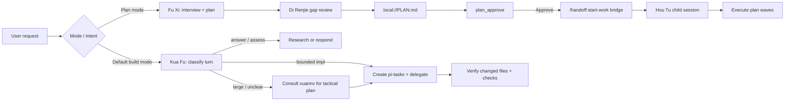
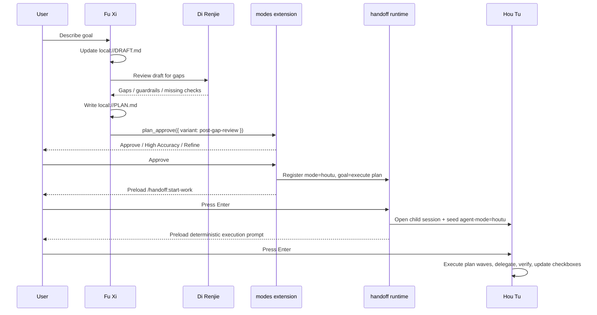
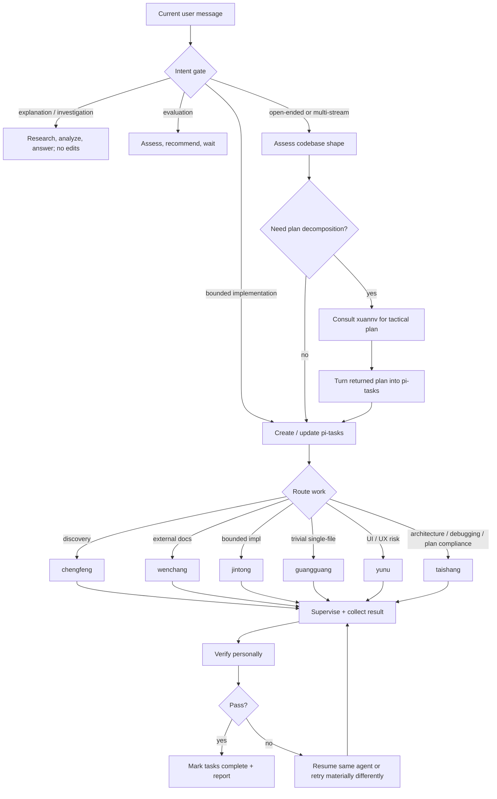
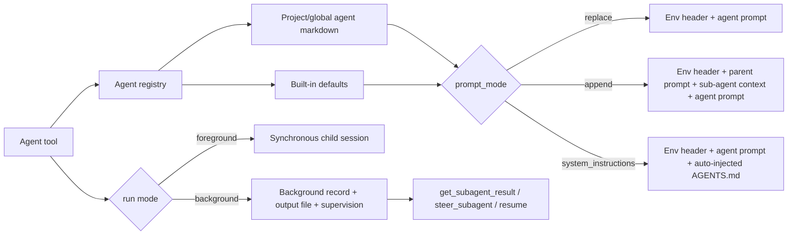

# Orchestration Flow

This document describes the repo's two orchestration workflows. It is descriptive, not a stronger guarantee than the runtime implements.

## Two workflows

- **Fu Xi + Hou Tu** is the plan-and-execute workflow. Fu Xi plans; Hou Tu executes the approved plan in a child session.
- **Kua Fu** is the default build workflow. Kua Fu stays in the current session, routes work to specialists, and verifies results.

## Workflow 1: Fu Xi + Hou Tu plan execution

Use this flow when the user enters plan mode or asks for a plan-first execution path. The modes extension defines the personas and the handoff path: Fu Xi drafts with Di Renjie review, `plan_approve` presents review choices, and approval prepares a Hou Tu handoff.

### Lifecycle

1. **Interview draft**
   - Fu Xi records the interview and research notes in `local://DRAFT.md`.
   - Plan-mode hooks restrict writes to `local://DRAFT.md` and `local://PLAN.md`, block built-in `bash`, and leave read-only shell inspection to allowlisted tools.

2. **Di Renjie gap review**
   - Fu Xi reads the draft, calls Di Renjie, and asks for missing questions, guardrails, assumptions, acceptance criteria, and edge cases.
   - This review is a prompt/protocol requirement. It is not a runtime-enforced state transition.

3. **Plan write**
   - Fu Xi writes `local://PLAN.md` with objectives, guardrails, verification strategy, execution waves, TODOs, and final verification gates.
   - The plan must contain enough references and acceptance criteria for an execution agent with no interview context.

4. **Approval menu**
   - Fu Xi calls `plan_approve`.
   - `post-gap-review` offers editor refinement, Plannotator refinement, Yan Luo high-accuracy review, and approve.
   - `post-high-accuracy` offers editor refinement, Plannotator refinement, and approve.

5. **Approved handoff preparation**
   - Approval marks the plan review state approved.
   - The modes extension prepares handoff args with `mode: "houtu"`, `summarize: false`, and a goal built from the approved plan path via `buildPlanExecutionGoal(planPath)`.
   - The current editor is prefilled with `/handoff:start-work`; implementation has not started yet.

6. **Handoff command**
   - `/handoff:start-work` asks the handoff runtime for prepared handoff args.
   - The runtime opens a child session, seeds `agent-mode: houtu`, preloads a deterministic execution prompt, and waits for the user to press Enter.

7. **Hou Tu execution**
   - Hou Tu reads `PLAN.md` at the approved path, creates one pi-task per top-level plan task, wires the dependency DAG, then analyzes runnable tasks.
   - Parent initializes and curates `local://{plan-name}/notepads/` with `learnings.md`, `decisions.md`, `issues.md`, and `blockers.md`.
   - PLAN is the durable source of truth; Task is its synchronized runtime mirror. Hou Tu updates both only after parent verification.
   - Each task ID identifies one bounded plan task. Independent implementation launches as multiple foreground `Agent` calls in one assistant response; they execute concurrently while Hou Tu blocks until all return. Background runs are only for non-blocking exploration/research.
   - Worker prompts retain exactly six top-level sections. Capability-aware shared-note instructions live under CONTEXT.
   - All workers read only relevant shared notes. Mutation-capable workers append only relevant findings and preserve unrelated entries; read-only researchers return findings to parent for curation.
   - Hou Tu rereads relevant notes and independently verifies them; notes remain worker claims until verification.
   - Shared Agent-tree storage is same-user collaboration, not sandbox or security isolation.
   - Hou Tu delegates product-code, test-file, documentation, and git mutations. Parent work is verification plus PLAN, Task, and notepad orchestration-state mutation.
   - Hou Tu verifies every delegation with diagnostics, builds/tests where applicable, manual readback, plan-state checks, and hands-on QA when needed.
   - After verification, Hou Tu updates plan checkboxes and continues through final verification gates.

## Workflow 2: Kua Fu general build mode

Kua Fu is the default mode. It ships by orchestration, not by defaulting to direct edits. It only edits directly when the change is tiny, local, low-risk, and no specialist has an advantage.

### Lifecycle

1. **Intent gate**
   - Kua Fu classifies the current user message only.
   - Explanation, investigation, comparison, and evaluation requests do not trigger edits.
   - Concrete implementation proceeds only when scope is clear enough, no blocking specialist result is pending, and the work shape is known.

2. **Recon and planning**
   - For non-trivial codebase questions, Kua Fu starts `chengfeng` in the background unless the exact location is already known.
   - For external-library or pattern questions, it starts `wenchang` when outside context improves correctness.
   - For large, sequential, or unclear work, Kua Fu consults `xuannv` for a tactical plan (passing gathered context) and converts the returned plan into pi-tasks. For full plan-first execution the user switches to Fu Xi (`/mode fuxi`); Kua Fu does not spawn Fu Xi as a subagent.

3. **Task routing**
   - One bounded chunk goes to one specialist.
   - Independent chunks are split into parallel delegations.
   - Kua Fu routes discovery to `chengfeng`, external research to `wenchang`, bounded implementation to `jintong`, trivial single-file edits to `guangguang`, UI/UX risk to `yunu`, and architecture, debugging, or plan-compliance escalation to `taishang`.
   - Kua Fu may consult `xuannv` for tactical planning. `fuxi` and `houtu` are modes, not subagent types, so Kua Fu does not delegate to them (its frontmatter omits `fuxi` and explicitly disallows `houtu`).

4. **Supervision**
   - Background-agent completion notifications trigger collection with `get_subagent_result`; Kua Fu does not poll. It uses `steer_subagent` only when live work drifts or stalls.
   - Failed delegated work should resume the same agent when useful, instead of spawning duplicate context.

5. **Verification**
   - Kua Fu reads changed files itself, runs diagnostics and focused checks, then applies the orchestrator-owned code-quality gate before confirming the request is fully satisfied.
   - Delegation does not count as verification.

## GPT orchestration tier guidance

These are the current GPT frontmatter defaults for mode and agent model chains. Non-OpenAI fallback providers remain in each chain for availability/profile fallback. Hou Tu follows upstream Atlas at GPT-5.5 medium; other listed surfaces use GPT-5.6.

| Surface | Duty shape | Recommended GPT target | Rationale |
|---|---|---|---|
| `fuxi`, `yanluo` | decision-complete planning and final high-accuracy plan review | `openai-codex/gpt-5.6-sol:xhigh` | Highest consequence reasoning; failures create bad downstream work. |
| `taishang`, `direnjie`, `juling`, `yunu`, `luban`, `shennong` | deep consult, gap analysis, complex implementation, UI judgment, skill discipline, product judgment | `openai-codex/gpt-5.6-sol:high` | These roles depend on trade-off judgment and catching subtle risks. |
| `kuafu` | default orchestrator: intent gate, delegation, supervision, verification | `openai-codex/gpt-5.6-sol:medium` by default; raise to `:high` for large/multi-stream work | After prompt audit, Kua Fu is too judgment-heavy for Terra by default, but it runs often enough that `medium` is the cost/speed guard. |
| `houtu` | Atlas-aligned execution conductor | `openai-codex/gpt-5.5:medium` | Matches upstream Atlas GPT-family model and effort while preserving the local provider ladder. |
| `jintong` | bounded implementation | `openai-codex/gpt-5.6-terra:medium` | Terra suits routine implementation while keeping cost below Sol. |

`chengfeng`, `wenchang`, and `guangguang` retain their prior OpenAI models. `gpt-5.6-luna` is present in Pi 0.80.5's catalog but failed runtime resolution during migration health checks, so Luna adoption is deferred.

## Shared subagent foundation

Both workflows depend on the subagent extension.

- `extensions/subagents/src/index.ts` registers `Agent`, background execution, resume, `get_subagent_result`, and `steer_subagent`.
- `extensions/subagents/src/custom-agents.ts` loads agent markdown from project `.pi/agents/*.md` and global `~/.pi/agent/agents/*.md`; project agents override global agents.
- `extensions/subagents/src/prompts.ts` builds prompts from agent frontmatter. `replace` gives the child a fresh prompt; `append` wraps the parent prompt with sub-agent context and the child instructions; `system_instructions` returns the same prompt as `replace` and lets pi auto-inject AGENTS.md (project guardrails) without parent identity bleed — see `agent-runner.ts` `inheritContextFiles`.
- `modes/fuxi/mode.md`, `modes/houtu/mode.md`, and `modes/kuafu/mode.md` are the prompt contracts that define the workflows above.

## Ownership by file

### `extensions/modes/src/index.ts`

Modes entry point. It defines Kua Fu as default, wires mode commands/hooks, registers `plan_approve`, and exposes prepared handoff args for approved Fu Xi plans.

### `extensions/modes/src/plan-approval.ts`

Approval menu implementation. It owns `post-gap-review`, `post-high-accuracy`, editor refinement, Plannotator refinement, Yan Luo instructions, and approved handoff calls.

### `extensions/modes/src/plannotator.ts`

Modes-side Plannotator coordination. It prepares approved plan handoff, persists approval state, preloads `/handoff:start-work`, and registers a direct handoff for `mode: "houtu"`.

### `extensions/handoff/runtime.ts`

Handoff runtime. It owns prepared handoff lookup, `/handoff:start-work`, child session creation, `agent-mode` seeding, deterministic execution prompt construction, and optional generic handoff summarization.

### `extensions/subagents/src/index.ts`

Subagent runtime entry point. It registers `Agent`, handles foreground/background runs, exposes supervision tools, emits lifecycle events, and tracks background records.

### `extensions/subagents/src/custom-agents.ts`

Custom agent loader. It scans project and global agent markdown, parses frontmatter, and lets project agents override global agents.

### `extensions/subagents/src/prompts.ts`

Prompt builder. It renders `replace`, `append`, and `system_instructions` prompt modes and injects skill/memory extras.

### `modes/fuxi/mode.md`

Fu Xi's planning protocol. It defines the interview draft workflow, Di Renjie review, `local://PLAN.md` structure, approval flow, and the Yan Luo high-accuracy loop.

### `modes/houtu/mode.md`

Hou Tu's execution protocol. It defines plan-wave task registration, one-task-per-delegation execution, verification gates, notepad updates, retry/resume behavior, and final review gates.

### `modes/kuafu/mode.md`

Kua Fu's build protocol. It defines intent gating, orchestration-first routing, `xuannv` tactical-planning consults, subagent supervision, task usage, and verification requirements.

## Boundary rules

- Plan approval prepares execution; it does not start implementation.
- `/handoff:start-work` opens and preloads a child session; execution starts only after the user sends the preloaded prompt.
- Di Renjie and Yan Luo are prompt/protocol gates, not hard runtime state machines.
- Hou Tu executes approved plans; Kua Fu handles general build work in the current session.
- Kua Fu does not spawn Fu Xi as a subagent (`fuxi` is a mode, not a delegation target). For tactical planning Kua Fu consults `xuannv`; for plan-first execution the user switches to Fu Xi (`/mode fuxi`), and only that approval flow uses the `/handoff:start-work` bridge.
- Both workflows rely on personal verification after delegation. Agent self-reports are never enough.
