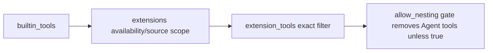

# Subagents

Claude Code-style autonomous sub-agents for Pi. Spawn specialized agents in isolated sessions with their own tools, model, thinking level, and system prompt. Run foreground or background, steer mid-run, resume completed sessions.

Vendored from [@tintinweb/pi-subagents](https://github.com/tintinweb/pi-subagents) v0.6.3. See [CHANGELOG.md](CHANGELOG.md) for upstream history.

## Tools and Commands

- `Agent` — spawn a new agent or resume an existing one. Required params: `prompt`, `description`. Optional params: `subagent_type` (default `general-purpose`), `run_in_background`, `resume`, `model` (fuzzy `"haiku"`, `"sonnet"`, or full `"provider/modelId"`), `thinking`, `max_turns`, `inherit_context`, `isolated`, `isolation: "worktree"`.
- `get_subagent_result` — check status or wait for a background agent. Params: `agent_id` (required), `wait`, `verbose`.
- `steer_subagent` — inject a message into a running agent. Params: `agent_id` (required), `message` (required).
- `/agents` — browse running agents, view conversations, create/edit/eject/disable custom agents, configure settings.

## Default Agent Types

| Type | Built-ins | Extensions | Model | Prompt Mode |
|------|-----------|------------|-------|-------------|
| `general-purpose` | all | all | inherit | append (parent twin) |
| `Explore` | read, bash, grep, find, ls | all | haiku | replace (standalone) |
| `Plan` | read, bash, grep, find, ls | all | inherit | replace (standalone) |

Defaults can be overridden by creating `.pi/agents/<name>.md` with the same name, or ejected via `/agents` menu.

## Custom Agents

Define agents as `.md` files with YAML frontmatter. Project `.pi/agents/<name>.md` wins over global `$PI_CODING_AGENT_DIR/agents/<name>.md` (default `~/.pi/agent/agents/`). Filename = agent type name.

| Field | Default | Meaning |
|-------|---------|---------|
| `builtin_tools` | all built-ins | Exact built-in allowlist: `read`, `bash`, `edit`, `write`, `grep`, `find`, `ls`; use `none` for no built-ins. |
| `extensions` | `true` | Extension availability/source scope: `true`/omitted = extension tools enabled, `false`/`none` = none, CSV = source names preserved where supported. Current active-tool filtering treats CSV as enabled; it is not a fuzzy tool matcher. |
| `extension_tools` | all available extension tools | Exact extension-tool allowlist after extensions are available; `none` means no extension tools. Cannot grant built-ins. |

Tool evaluation order:



`extensions` × `extension_tools` defaults:

| `extensions` | `extension_tools` omitted | `extension_tools: none` | `extension_tools: foo` |
|--------------|---------------------------|-------------------------|------------------------|
| omitted/`true` | all available extension tools | no extension tools | only exact `foo` |
| CSV | all available extension tools (source names preserved where supported) | no extension tools | only exact `foo` |
| `false`/`none` | no extension tools | no extension tools | no extension tools |

Example `.pi/agents/auditor.md`:

```markdown
---
description: Security Code Reviewer
builtin_tools: read, bash, grep, find
extensions: false
model: anthropic/claude-opus-4-6
max_turns: 30
---
Review code for vulnerabilities. Report findings with file paths, line numbers, severity, and remediation.
```

More tool-shape examples:

```yaml
# read-only agent
builtin_tools: read, bash, grep, find, ls
extensions: false

# extension-tool agent
builtin_tools: read, bash
extensions: web-search
extension_tools: web_search

# no-extension agent with normal built-ins
extensions: false

# write-less agent with explicit built-ins
builtin_tools: read, bash, grep, find, ls
extension_tools: none
```

Migration notes:
- `tools:` is invalid/obsolete. Use `builtin_tools` for built-in tools and `extension_tools` for extension/custom tools instead.
- `disallowed_tools:` and `disallow_tools:` are invalid/obsolete. Express the exact allowed set with `builtin_tools` and `extension_tools` instead.
- `inherit_extensions` remains a compatibility alias; prefer `extensions` in new docs and agent files.

## Settings

Configured via `/agents` → Settings. Persisted to `<cwd>/.pi/subagents.json` (project) with global defaults from `~/.pi/agent/subagents.json`. Defaults: max concurrency 4, max turns unlimited, grace turns 5, join mode `smart`.

## UI Formatting

Status widgets, Agent result renderers, and background completion notifications use compact Nerd Font stats: `⟳ 5≤30 · 󱁤 3 · 󰾆 33.8k · 4.1s`. Preserve local UI stat formatting during upstream syncs.

## Events

Lifecycle events on `pi.events`: `subagents:created`, `subagents:started`, `subagents:completed`, `subagents:failed`, `subagents:steered`, `subagents:ready`, `subagents:settings_loaded`, `subagents:settings_changed`. Cross-extension RPC: `subagents:rpc:ping`, `subagents:rpc:spawn`, `subagents:rpc:stop` with reply on `:reply:${requestId}`.

## Local Additions

Features added on top of upstream: background supervision, delegation policy, result recovery, thinking-level normalization, enhanced skill loading, abort signal forwarding, model label tracking, and Nerd Font UI stats.
